*Inspired by [refactoring.guru](https://refactoring.guru/design-patterns)*

# Menu
- [Behavioral](#behavioral)
    - [Chain of Responsibility](#chain-of-responsibility)
    - [Command](#command)
    - [Iterator](#iterator)
    - [Mediator](#mediator)
    - [Memento](#memento)
    - [Observer](#observer)
    - [State](#state)
    - [Strategy](#strategy)
    - [Template Method](#template-method)
    - [Visitor](#visitor)
- [Creational](#creational)
    - [Factory](#factory)
    - [Abstract Factory](#abstract-factory)
    - [Builder](#builder)
    - [Prototype](#prototype)
    - [Singleton](#singleton)
- [Structural](#structural)
    - [Adapter](#adapter)
    - [Bridge](#bridge)
    - [Composite](#composite)
    - [Decorator](#decorator)
    - [Facade](#facade)
    - [Flyweight](#flyweight)
    - [Proxy](#proxy)

# Behavioral
## [Chain of Responsibility](python/patterns/behavioral/chain-of-responsibility.py)
#### What
Pass a request through a chain of handlers. Each handler decides whether to process the request or pass it to the next handler in the chain.

#### Useful for
- Avoiding coupling between objects. The sender only need to know *how* to send the request, not *who* will handle it
- Adding/removing handlers is easy (code isolation)
- Single Responsibility Principle

#### Exemple
- `Handler` : Interface that dictate what methods are mandatory
- `AbstractHandler` : Boilerplate code for the handlers
- `InfoHandler`, `ErrorHandler`, `FailureHandler` : Concrete handlers that each implement a way of processing the request
- `Client` | `Logger` : Controller that build the chain of handlers and send the request to the first handler. Help use the chain of responsibility 

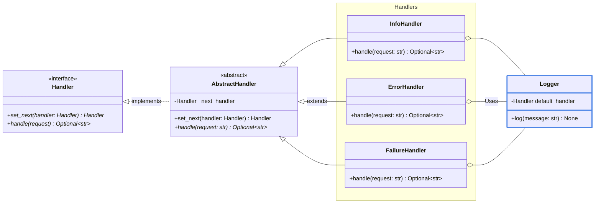
```mermaid
classDiagram
    direction LR

    class Handler {
        <<interface>>
        +set_next(handler: Handler)* Handler
        +handle(request)* Optional~str~
    }

    class AbstractHandler {
        <<abstract>>
        -Handler _next_handler
        +set_next(handler: Handler) Handler
        +handle(request: str)* Optional~str~
    }

    class InfoHandler {
        +handle(request: str) Optional~str~
    }
    class ErrorHandler {
        +handle(request: str) Optional~str~
    }
    class FailureHandler {
        +handle(request: str) Optional~str~
    }

    class Logger {
        -Handler default_handler
        +log(message: str) None
    }

    Handler <|.. AbstractHandler : implements
    
    AbstractHandler <|-- InfoHandler
    AbstractHandler <|-- ErrorHandler : extends
    AbstractHandler <|-- FailureHandler

    InfoHandler    o-- Logger
    ErrorHandler   o-- Logger : Uses
    FailureHandler o-- Logger

    namespace Handlers {
        class InfoHandler
        class ErrorHandler
        class FailureHandler
    }

    style Logger stroke:#4D85E6,stroke-width:3px
```

<h5>Sequence Diagram</h5>

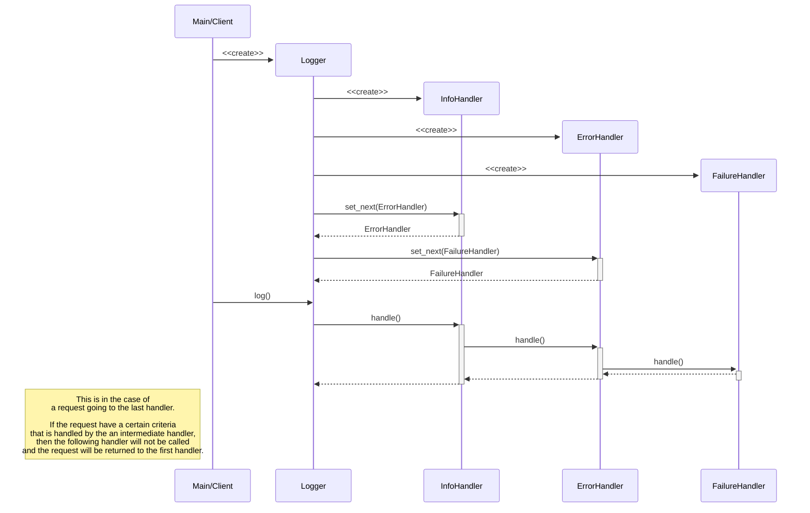
```mermaid
sequenceDiagram
    participant Main/Client

    create participant Logger
    Main/Client->>Logger: <<create>>

    create participant InfoHandler
    Logger->>InfoHandler: <<create>>
    create participant ErrorHandler
    Logger->>ErrorHandler: <<create>>
    create participant FailureHandler
    Logger->>FailureHandler: <<create>>

    Logger->>+InfoHandler: set_next(ErrorHandler)
    InfoHandler-->>-Logger: ErrorHandler
    Logger->>+ErrorHandler: set_next(FailureHandler)
    ErrorHandler-->>-Logger: FailureHandler

    Main/Client->>Logger: log()
    Logger->>+InfoHandler: handle()
    InfoHandler->>+ErrorHandler: handle()
    ErrorHandler->>+FailureHandler: handle()
    FailureHandler-->>-ErrorHandler: 
    ErrorHandler-->>-InfoHandler: 
    InfoHandler-->>-Logger: 
    Note left of Main/Client: This is in the case of <br> a request going to the last handler. <br><br> If the request have a certain criteria <br> that is handled by the an intermediate handler, <br> then the following handler will not be called <br> and the request will be returned to the first handler.
```

## [Command](python/patterns/behavioral/command.py)
#### What
Encapsulate all the information needed to perform an action. Each command can do an action or delegate it to a receiver. An invoker will execute these commands.

#### Useful for
- Decoupling the sender and receiver of a request (the invoker don't need to know the receiver implementation, it just execute the command)
- Adding/removing commands is easy (code isolation)
- Creating command history with undo/redo operations

#### Exemple
- `Command` : Interface that dictate the `execute` and `undo` method
- `Receiver` | `Document` : Contains the complex/external business logic
- `InsertCommand`, `DeleteCommand` : Implement the `execute` and `undo` method 
- `Invoker` | `Editor` : Contains the commands and execute them

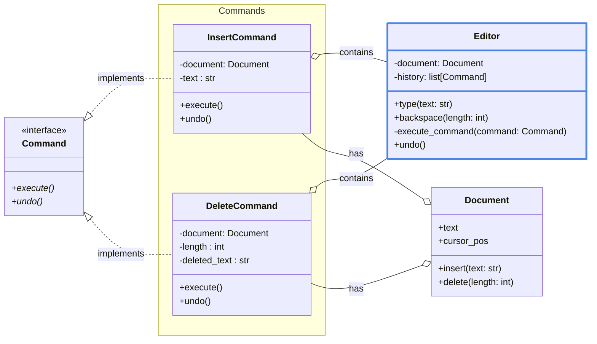
```mermaid
classDiagram
    direction LR
    class Command {
        <<interface>>
        +execute()*
        +undo()*
    }

    class InsertCommand {
        -document: Document
        -text : str
        +execute()
        +undo()
    }

    class DeleteCommand {
        -document: Document
        -length : int
        -deleted_text : str
        +execute()
        +undo()
    }

    class Document {
        +text
        +cursor_pos
        +insert(text: str)
        +delete(length: int)
    }

    class Editor {
        -document: Document
        -history: list[Command]
        +type(text: str)
        +backspace(length: int)
        -execute_command(command: Command)
        +undo()
    }
    

    Command <|.. InsertCommand : implements
    Command <|.. DeleteCommand : implements
    
    InsertCommand o-- Editor : contains
    DeleteCommand o-- Editor : contains
    

    DeleteCommand --o Document : has
    InsertCommand --o Document : has

    namespace Commands{
        class InsertCommand
        class DeleteCommand
    }

    style Editor stroke:#4D85E6,stroke-width:3px
```

<h5>Sequence Diagram</h5>

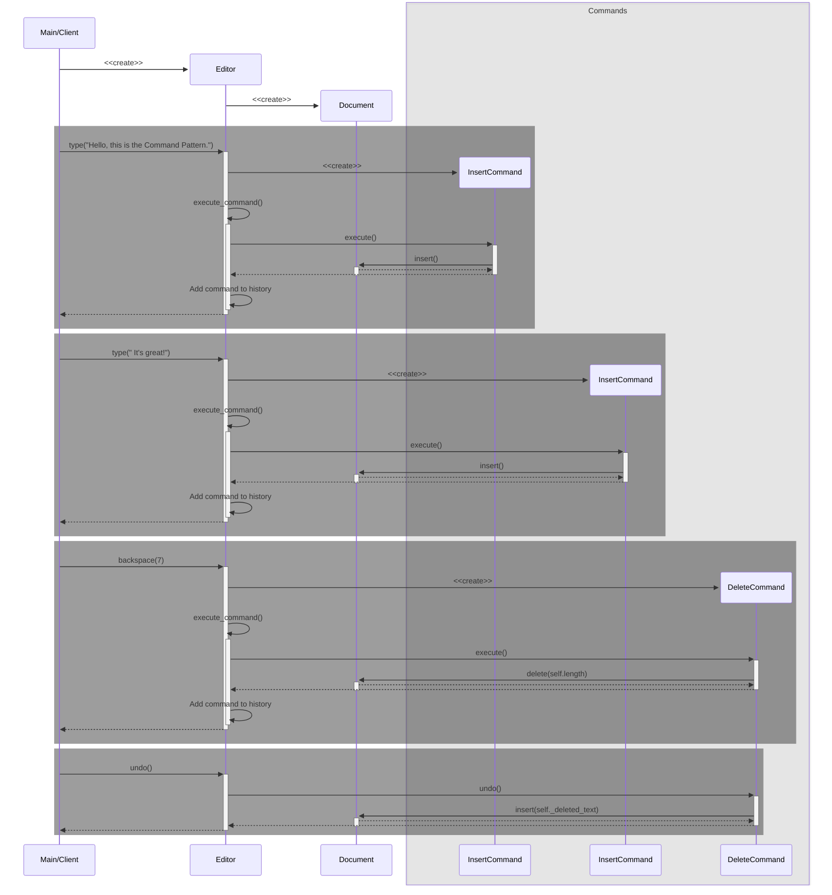
```mermaid
sequenceDiagram
    participant Main/Client

    create participant Editor
    Main/Client->>Editor: <<create>>

    create participant Document
    Editor->>Document: <<create>>
    
    % --------------------------------------------------------
    rect rgba(61, 61, 61, 0.5)
        Main/Client->>+Editor: type("Hello, this is the Command Pattern.")

        create participant InsertCommand1 as InsertCommand
        Editor->>InsertCommand1: <<create>>

        Editor->>+Editor: execute_command()
        Editor->>+InsertCommand1: execute()
        InsertCommand1->>+Document: insert()
        Document-->>-InsertCommand1: 
        InsertCommand1-->>-Editor: 
        Editor->>-Editor: Add command to history
        Editor-->>-Main/Client:
    end

    % --------------------------------------------------------
    rect rgba(61, 61, 61, 0.5)
        Main/Client->>+Editor: type(" It's great!")

        create participant InsertCommand2 as InsertCommand
        Editor->>InsertCommand2: <<create>>

        Editor->>+Editor: execute_command()
        Editor->>+InsertCommand2: execute()
        InsertCommand2->>+Document: insert()
        Document-->>-InsertCommand2: 
        InsertCommand2-->>-Editor: 
        Editor->>-Editor: Add command to history
        Editor-->>-Main/Client:
    end

    % --------------------------------------------------------
    rect rgba(61, 61, 61, 0.5)
        Main/Client->>+Editor: backspace(7)

        create participant DeleteCommand1 as DeleteCommand
        Editor->>DeleteCommand1: <<create>>

        Editor->>+Editor: execute_command()
        Editor->>+DeleteCommand1: execute()
        DeleteCommand1->>+Document: delete(self.length)
        Document-->>-DeleteCommand1: 
        DeleteCommand1-->>-Editor: 
        Editor->>-Editor: Add command to history
        Editor-->>-Main/Client:
    end

    % --------------------------------------------------------
    rect rgba(61, 61, 61, 0.5)
        Main/Client->>+Editor: undo()

        Editor->>+DeleteCommand1: undo()
        DeleteCommand1->>+Document: insert(self._deleted_text)
        Document-->>-DeleteCommand1: 
        DeleteCommand1-->>-Editor: 
        Editor-->>-Main/Client:
    end

    % --------------------------------------------------------
    box rgba(158, 158, 158, 0.17) Commands
        participant InsertCommand1
        participant InsertCommand2
        participant DeleteCommand1
    end
```

## [Iterator](python/patterns/behavioral/iterator.py)
#### What
We have a collection of items in a certain structure (item in list/graph, words in sentence ...). We want to traverse that collection. We split the storing and the traversal behaviour

#### Useful for
- Decouple the Client and the logic : The client doesn't need to know *how* or *what* to traverse, they just get the next item
- Having multiple Iterator for a type of collection (exemple: graph => depth or breadth traversal) 
- Simplify the collection : Only store and create the iterator for the kind of traversing we want

#### Exemple 
- `Iterator` : Interface that dictate the `next` method (traverse the collection)
- `IterableCollection` : Interface that dictate the `iter` method (give the mean to traverse the collection)
- `WordCollection` : Store the data and give access to an iterator
- `WordIterator` : Store the collection and the function to traverse it

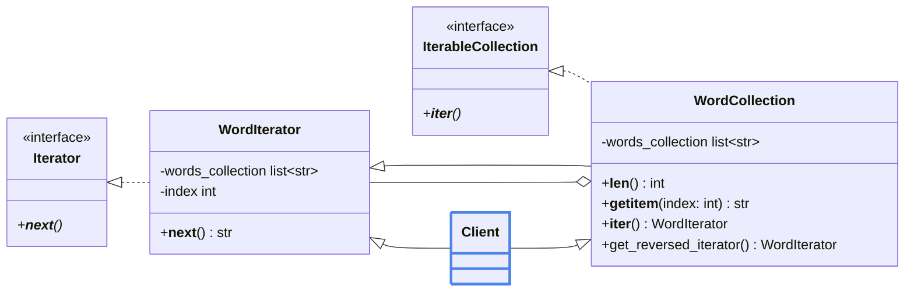
```mermaid
classDiagram
    direction LR

    class Iterator {
        <<interface>>
        +__next__()* 
    }

    class IterableCollection {
        <<interface>>
        +__iter__()* 
    }

    class WordIterator {
        -words_collection list~str~
        -index int
        +__next__() str
    }

    class WordCollection {
        -words_collection list~str~
        +__len__() int
        +__getitem__(index: int) str
        +__iter__() WordIterator
        +get_reversed_iterator() WordIterator
    }
    
    Iterator <|.. WordIterator 
    IterableCollection <|.. WordCollection 

    WordIterator <|-- WordCollection 
    WordIterator --o WordCollection

    WordIterator <|-- Client 
    Client --|> WordCollection 

    style Client stroke:#4D85E6,stroke-width:3px
```

<h5>Sequence Diagram</h5>

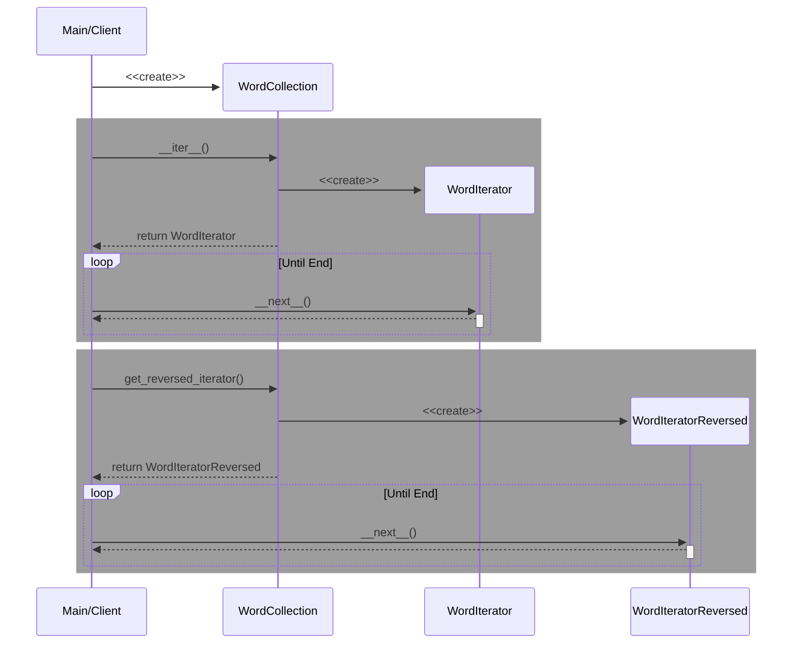
```mermaid
sequenceDiagram
    participant Main/Client

    create participant WordCollection
    Main/Client->>WordCollection: <<create>>

    % --------------------------------------------------------
    rect rgba(61, 61, 61, 0.5)
        Main/Client->>WordCollection: __iter__()
        create participant WordIterator 
        WordCollection->>WordIterator: <<create>>
        WordCollection-->>Main/Client: return WordIterator

        loop Until End
            Main/Client->>+WordIterator: __next__()
            WordIterator-->>-Main/Client: 
        end
    end
    
    % --------------------------------------------------------
    rect rgba(61, 61, 61, 0.5)
        Main/Client->>WordCollection: get_reversed_iterator()
        create participant WordIteratorReversed 
        WordCollection->>WordIteratorReversed: <<create>>
        WordCollection-->>Main/Client: return WordIteratorReversed

        loop Until End
            Main/Client->>+WordIteratorReversed: __next__()
            WordIteratorReversed-->>-Main/Client: 
        end
    end
```

## [Mediator](python/patterns/behavioral/mediator.py)

Not really useful

Just set a class that let you interface with a certain set of other object (exemple: A Dialog let us talk to its child (button, menus ...))

## [Memento](python/patterns/behavioral/memento.py)
#### What
A class that store/remember an object state. 

#### Useful for
Some undo redo operation, transactional operations, rollbacks, versioning ...

#### Exemple
- `Memento` : Interface that dictate the `get_save` method
- `Originator` : Interface that dictate the `save` method
- `TextEditor` : Store the current text state
- `TextEditorSnapshot` : Store **a** text state at a certain time. Do not expose the internal state
- `History` : Store the collection of `TextEditorSnapshot`. Have no access to its internal state

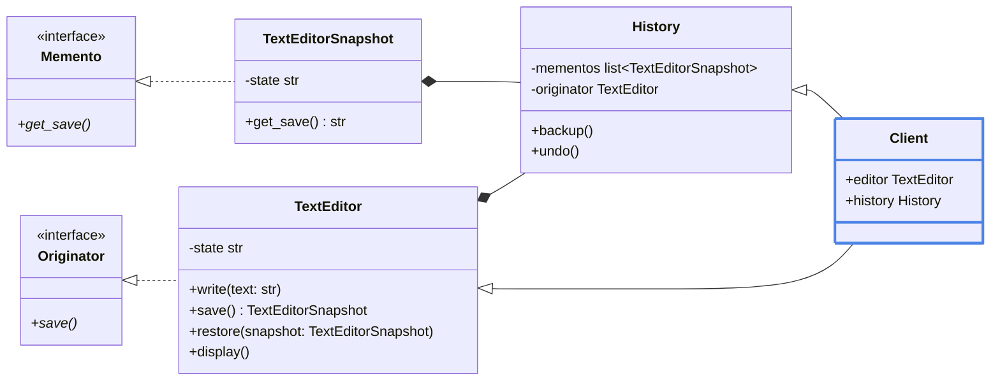
```mermaid
classDiagram
    direction LR

    class Memento {
        <<interface>>
        +get_save()* 
    }

    class Originator {
        <<interface>>
        +save()* 
    }

    class TextEditorSnapshot {
        -state str
        +get_save() str
    }

    class TextEditor {
        -state str
        +write(text: str)
        +save() TextEditorSnapshot
        +restore(snapshot: TextEditorSnapshot)
        +display()
    }

    class History {
        -mementos list~TextEditorSnapshot~
        -originator TextEditor
        +backup()
        +undo()
    }

    class Client {
        +editor TextEditor
        +history History
    }

    Memento <|.. TextEditorSnapshot
    Originator <|.. TextEditor

    TextEditorSnapshot *-- History
    TextEditor *-- History

    History <|-- Client
    TextEditor <|-- Client

    style Client stroke:#4D85E6,stroke-width:3px
```

<h5>Sequence Diagram</h5>

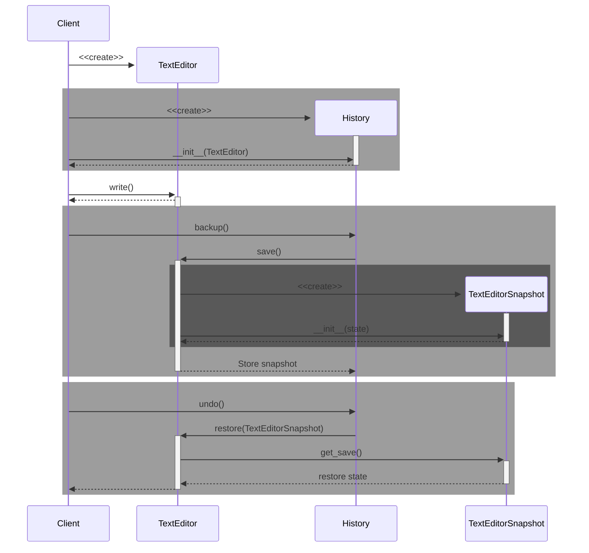
```mermaid
sequenceDiagram
    participant Client

    create participant TextEditor
    Client->>TextEditor: <<create>>
    
    rect rgba(61, 61, 61, 0.5)
        create participant History
        Client->>+History: <<create>>
        Client->>History: __init__(TextEditor)
        History-->>-Client: 
    end

    % --------------------------------------------------------
    Client->>+TextEditor: write()
    TextEditor-->>-Client: 

    rect rgba(61, 61, 61, 0.5)
        Client->>History: backup()
        History->>+TextEditor: save()
        
        rect rgba(61, 61, 61, 0.7)
            create participant TextEditorSnapshot
            TextEditor->>+TextEditorSnapshot: <<create>>
            TextEditor->>TextEditorSnapshot: __init__(state)
            TextEditorSnapshot-->>-TextEditor: 
        end
        
        TextEditor-->>-History: Store snapshot
    end

    
    % --------------------------------------------------------
    rect rgba(61, 61, 61, 0.5)
        Client->>History: undo()
        History->>+TextEditor: restore(TextEditorSnapshot)
        TextEditor->>+TextEditorSnapshot: get_save()
        TextEditorSnapshot-->>-TextEditor: restore state
        TextEditor-->>-Client: 

    end
```

## [Observer](python/patterns/behavioral/observer.py)
#### What
Observer pattern can subscribe to other objects and receive notification

#### Useful for 
- Send info to different system without them checkin continuously
- We can dynamically attach or detach observers at runtime
- Decouple the publisher from the action took (Here we send log info, but we don't know how is it handled)

#### Exemple
- `Subscriber` : dictate the `update` function
- `ConsoleSubscriber`, `FileSubscriber` : manage the reception of a message and handle how to proccess it (or pass it to the right system)
- `LoggerPublisher` : Emit the event to the Subscriber it have

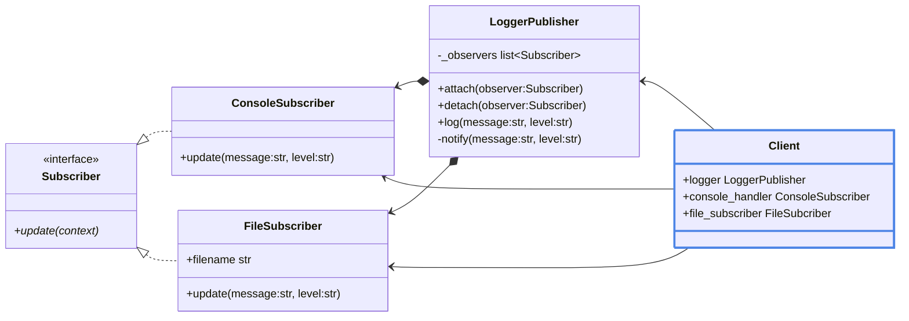
```mermaid
classDiagram
    direction LR

    class Subscriber {
        <<interface>>
        +update(context)* 
    }

    class ConsoleSubscriber {
        +update(message:str, level:str)
    }

    class FileSubscriber {
        +filename str
        +update(message:str, level:str)
    }

    class LoggerPublisher {
        -_observers list~Subscriber~
        +attach(observer:Subscriber)
        +detach(observer:Subscriber)
        +log(message:str, level:str)
        -notify(message:str, level:str)
    }

    class Client {
        +logger LoggerPublisher
        +console_handler ConsoleSubscriber
        +file_subscriber FileSubcriber
    }


    Subscriber <|.. ConsoleSubscriber
    Subscriber <|.. FileSubscriber

    ConsoleSubscriber <--* LoggerPublisher
    FileSubscriber <--* LoggerPublisher

    LoggerPublisher <-- Client
    FileSubscriber <-- Client
    ConsoleSubscriber <-- Client

    style Client stroke:#4D85E6,stroke-width:3px

```

<h5>Sequence Diagram</h5>

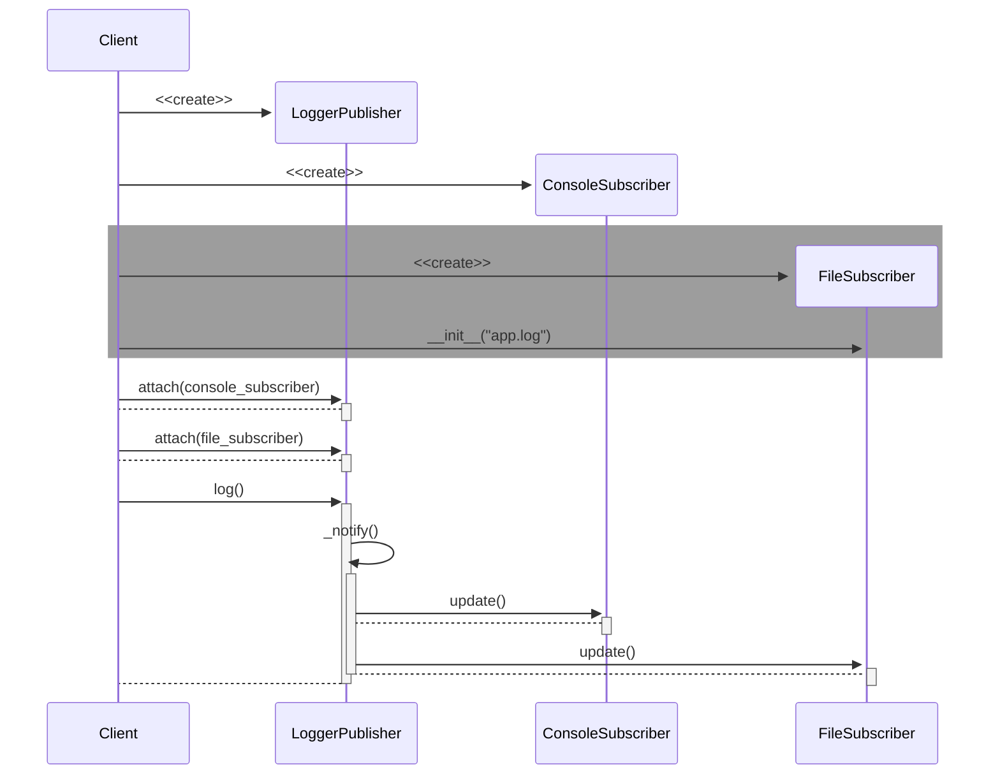
```mermaid
sequenceDiagram
    participant Client

    create participant LoggerPublisher
    Client->>LoggerPublisher: <<create>>

    create participant ConsoleSubscriber
    Client->>ConsoleSubscriber: <<create>>
    
    rect rgba(61, 61, 61, 0.5)
        create participant FileSubscriber
        Client->>+FileSubscriber: <<create>>
        Client->>FileSubscriber: __init__("app.log")
    end

    % --------------------------------------------------------
    Client->>+LoggerPublisher: attach(console_subscriber)
    LoggerPublisher-->-Client: 
    Client->>+LoggerPublisher: attach(file_subscriber)
    LoggerPublisher-->-Client: 

    Client->>+LoggerPublisher: log()
    LoggerPublisher->>LoggerPublisher: _notify()
    activate LoggerPublisher
    LoggerPublisher->>+ConsoleSubscriber: update()
    ConsoleSubscriber-->-LoggerPublisher: 
    LoggerPublisher->>+FileSubscriber: update()
    FileSubscriber-->-LoggerPublisher: 
    deactivate LoggerPublisher
    LoggerPublisher-->-Client: 

```

## [State](python/patterns/behavioral/state.py)
#### What
Extracting the state of an object into a separate set of class. Each class contains the logic and can change dynamically the state of the context object to another state if wanted.

#### Useful for
- Managing a state system and avoiding bloat/mess with an accumulation of conditions

#### Exemple
- `State` : dictate the actions functions (`on_play`, `on_pause`, `on_stop`) + some boilerplate code common for each child class
- `StoppedState`, `PlayingState`, `PausedState` : concrete states that implement the actions functions
- `AudioPlayer` : context class that holds the current state and can change it dynamically
- `Client|Main` : Manage the `AudioPlayer` and its state

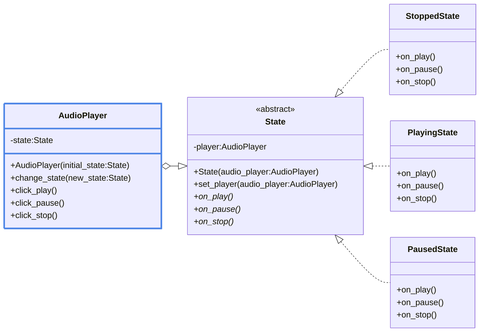
```mermaid
classDiagram
    direction LR

    class State {
        <<abstract>>
        -player:AudioPlayer
        +State(audio_player:AudioPlayer)
        +set_player(audio_player:AudioPlayer) 
        +on_play()*
        +on_pause()*
        +on_stop()*
    }

    class StoppedState {
        +on_play()
        +on_pause()
        +on_stop()
    }
    
    class PlayingState {
        +on_play()
        +on_pause()
        +on_stop()
    }   

    class PausedState {
        +on_play()
        +on_pause()
        +on_stop()
    }

    class AudioPlayer {
        -state:State
        +AudioPlayer(initial_state:State)
        +change_state(new_state:State)
        +click_play()
        +click_pause()
        +click_stop()
    }


    State <|..StoppedState
    State <|..PlayingState
    State <|..PausedState
    AudioPlayer o--|> State

    style AudioPlayer stroke:#4D85E6,stroke-width:3px
```

<h5>Sequence Diagram</h5>

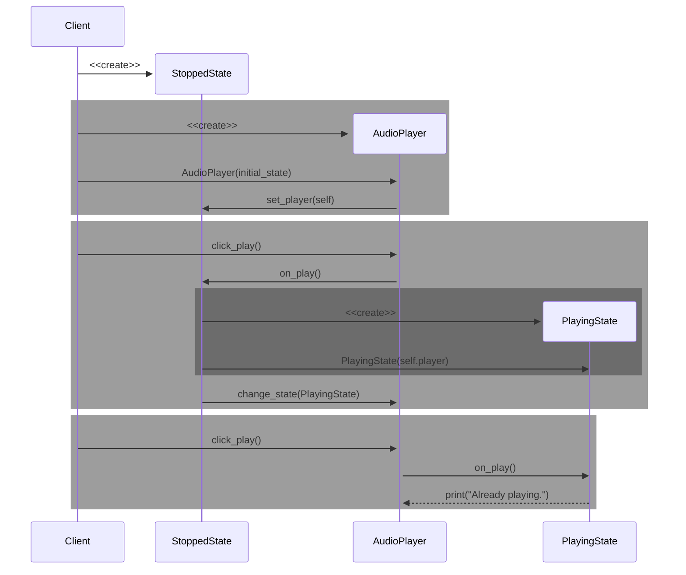
```mermaid

sequenceDiagram
    participant Client

    create participant StoppedState
    Client->>StoppedState: <<create>>

    rect rgba(61, 61, 61, 0.5)
        create participant AudioPlayer
        Client->>+AudioPlayer: <<create>>
        Client->>AudioPlayer: AudioPlayer(initial_state)
        AudioPlayer->>StoppedState: set_player(self)
    end

    % --------------------------------------------------------
    rect rgba(61, 61, 61, 0.5)
        Client->>AudioPlayer: click_play()
        AudioPlayer->>StoppedState: on_play()

        rect rgba(61, 61, 61, 0.5)
            create participant PlayingState
            StoppedState->>PlayingState: <<create>>
            StoppedState->>PlayingState: PlayingState(self.player)
        end

        StoppedState->>AudioPlayer: change_state(PlayingState)
    end

    % --------------------------------------------------------
    rect rgba(61, 61, 61, 0.5)
        Client->>AudioPlayer: click_play()
        AudioPlayer->>PlayingState: on_play()
        PlayingState-->>AudioPlayer: print("Already playing.")
    end
```

## [Strategy](python/patterns/behavioral/strategy.py)
#### What
A way to externalize algorithm from an object.

It architecture is similar to `State` but it does not externalize state but logic.

It looks similar to `Command` because it parameterizes an object with action. But `Command` convert an operation in an object, while `Strategy` describes different way of doing the same thing, letting us swap algorithms in a signle *context* class

#### Useful For
- Simplifying the `Context` class by externalizing the logic.
- We can easily add other algorithms without touching the `Context` class.
- We can change the algorithm at runtime.

#### Example
- `ExportStrategy` : dictate the `export` function
- `PngExportStrategy`, `JpegExportStrategy`, `SvgExportStrategy` : implement the `export` function for different export types.
- `ImageExporter` : use the `ExportStrategy` dynamically set by the `Client/Main` to export the image.

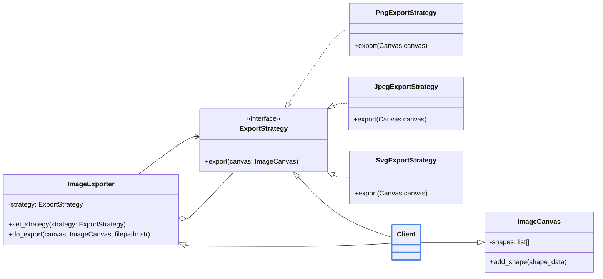
```mermaid
classDiagram
    direction LR

    class ExportStrategy {
        <<interface>>
        +export(canvas: ImageCanvas)
    }

    class PngExportStrategy {
        +export(Canvas canvas)
    }
    class JpegExportStrategy {
        +export(Canvas canvas)
    }
    class SvgExportStrategy {
        +export(Canvas canvas)
    }

    class ImageCanvas {
        -shapes: list[]
        +add_shape(shape_data)
    }

    class ImageExporter {
        -strategy: ExportStrategy
        +set_strategy(strategy: ExportStrategy)
        +do_export(canvas: ImageCanvas, filepath: str)
    }

    ExportStrategy <|.. PngExportStrategy
    ExportStrategy <|.. JpegExportStrategy
    ExportStrategy <|.. SvgExportStrategy

    ImageExporter --> ExportStrategy
    ImageExporter o-- ExportStrategy

    ExportStrategy <|-- Client
    ImageExporter <|-- Client
    Client --|> ImageCanvas

    style Client stroke:#4D85E6,stroke-width:3px

```

<h5>Sequence Diagram</h5>

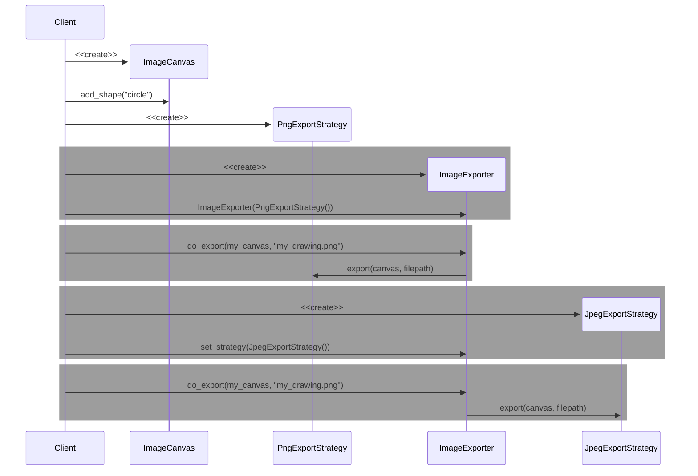
```mermaid
sequenceDiagram
    participant Client

    create participant ImageCanvas
    Client->>ImageCanvas: <<create>>
    Client->>ImageCanvas: add_shape("circle")

    create participant PngExportStrategy
    Client->>PngExportStrategy: <<create>>

    rect rgba(61, 61, 61, 0.5)
        create participant ImageExporter
        Client->>ImageExporter: <<create>>
        Client->>ImageExporter: ImageExporter(PngExportStrategy())
    end


    % --------------------------------------------------------
    
    rect rgba(61, 61, 61, 0.5)
        Client->>ImageExporter: do_export(my_canvas, "my_drawing.png")
        ImageExporter->>PngExportStrategy: export(canvas, filepath)
    end

    % --------------------------------------------------------
    rect rgba(61, 61, 61, 0.5)
        create participant JpegExportStrategy
        Client->>JpegExportStrategy: <<create>>
        Client->>ImageExporter: set_strategy(JpegExportStrategy())
    end

    rect rgba(61, 61, 61, 0.5)
        Client->>ImageExporter: do_export(my_canvas, "my_drawing.png")
        ImageExporter->>JpegExportStrategy: export(canvas, filepath)
    end


```

## [Template Method](python/patterns/behavioral/template_method.py)
#### What
Use an abstract template class that implement some step for an algorithm common for different algorithms, and implement the steps that are different in the subclasses.

#### Useful For
- A step by step algorithm that has some steps in common and some steps that are different for different algorithms.

#### Example
- `ReportGenerator` : Dictate the steps for generating a report. Only the common steps are implemented in the abstract class. The steps that are different are implemented in the subclasses.
- `CsvReportGenerator`, ``JsonReportGenerator``: Implement the steps that are different for each type of report.
- `Client`: Manage the report generation process.

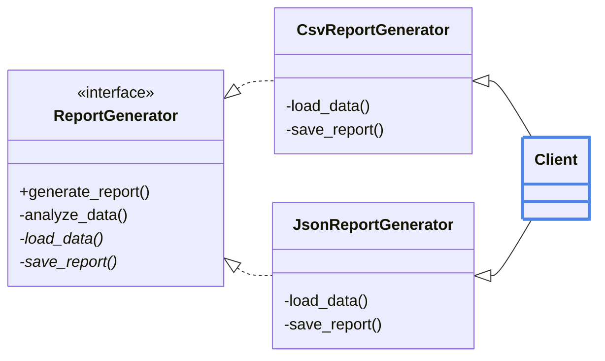
```mermaid
classDiagram
    direction LR

    class ReportGenerator {
        <<interface>>
        +generate_report()
        -analyze_data()
        -load_data()*
        -save_report()*
    }

    class CsvReportGenerator {
        -load_data()
        -save_report()
    }

    class JsonReportGenerator {
        -load_data()
        -save_report()
    }

    ReportGenerator <|.. CsvReportGenerator
    ReportGenerator <|.. JsonReportGenerator
    
    CsvReportGenerator  <|-- Client
    JsonReportGenerator <|-- Client

    style Client stroke:#4D85E6,stroke-width:3px
```

<h5>Sequence Diagram</h5>

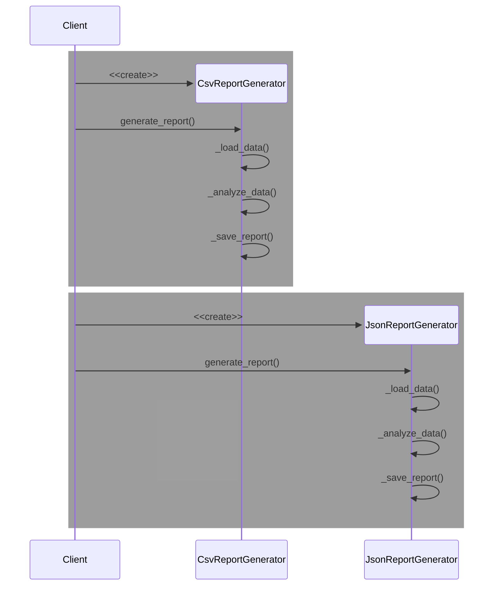
```mermaid
sequenceDiagram
    participant Client

    rect rgba(61, 61, 61, 0.5)
        create participant CsvReportGenerator
        Client->>CsvReportGenerator: <<create>>
        Client->>CsvReportGenerator: generate_report()
        CsvReportGenerator->>CsvReportGenerator: _load_data()
        CsvReportGenerator->>CsvReportGenerator: _analyze_data()
        CsvReportGenerator->>CsvReportGenerator: _save_report()
    end

    rect rgba(61, 61, 61, 0.5)
        create participant JsonReportGenerator
        Client->>JsonReportGenerator: <<create>>
        Client->>JsonReportGenerator: generate_report()
        JsonReportGenerator->>JsonReportGenerator: _load_data()
        JsonReportGenerator->>JsonReportGenerator: _analyze_data()
        JsonReportGenerator->>JsonReportGenerator: _save_report()
    end
```

## [Visitor](python/patterns/behavioral/visitor.py)
#### What
A way to externalize the algorithm from classes. It allows to add new operations to existing classes without modifying them.

#### Useful For
- When you have a class hierarchy and you want to add new operations to it without modifying the classes.
- When you want to separate the algorithm from the object structure

##### Exemple
- `Node` : The interface that defines the `accept()` method
- `Visitor` : The interface that defines the `visit_number_node()`, `visit_add_node()`, and `visit_multiply_node()` methods
- `NumberNode`, `AddNode`, `MultiplyNode` : The concrete classes that implement the `Node` interface. Each accept a visitor that can access internal data. So we do not modify the object itself.
- `PythonCodeGenerator` : An implemented `Visitor` that contains the algorithms to visite the nodes and generate Python code.

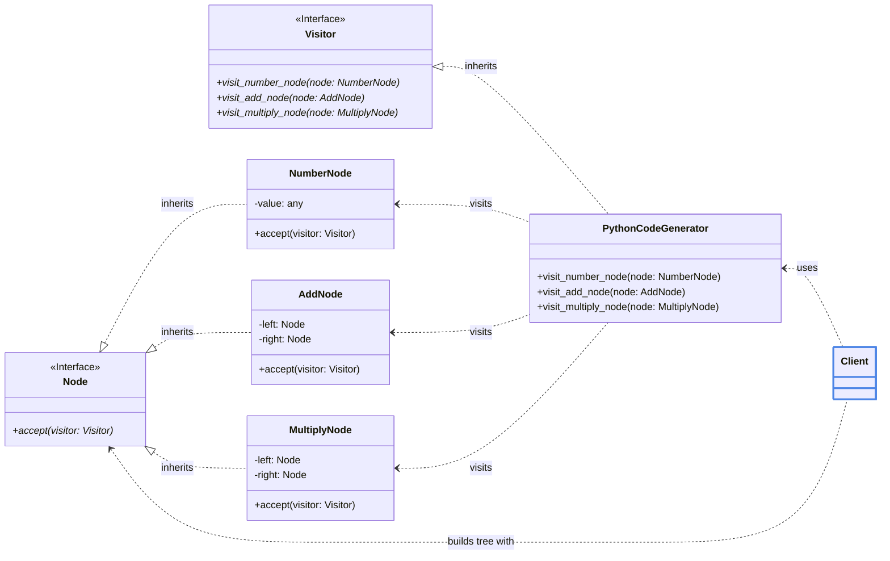
```mermaid
      
classDiagram
    direction LR

    class Node {
        <<Interface>>
        +accept(visitor: Visitor)*
    }

    class Visitor {
        <<Interface>>
        +visit_number_node(node: NumberNode)*
        +visit_add_node(node: AddNode)*
        +visit_multiply_node(node: MultiplyNode)*
    }

    class NumberNode {
        -value: any
        +accept(visitor: Visitor)
    }
    class AddNode {
        -left: Node
        -right: Node
        +accept(visitor: Visitor)
    }
    class MultiplyNode {
        -left: Node
        -right: Node
        +accept(visitor: Visitor)
    }

    class PythonCodeGenerator {
        +visit_number_node(node: NumberNode)
        +visit_add_node(node: AddNode)
        +visit_multiply_node(node: MultiplyNode)
    }

    class Client


    Node <|.. NumberNode : inherits
    Node <|.. AddNode : inherits
    Node <|.. MultiplyNode : inherits
    

    Visitor <|.. PythonCodeGenerator : inherits

    PythonCodeGenerator <.. Client : uses
    Node <.. Client : builds tree with

    NumberNode <.. PythonCodeGenerator : visits
    AddNode <.. PythonCodeGenerator : visits
    MultiplyNode <.. PythonCodeGenerator : visits

    style Client stroke:#4D85E6,stroke-width:3px
```

<h5>Sequence Diagram</h5>

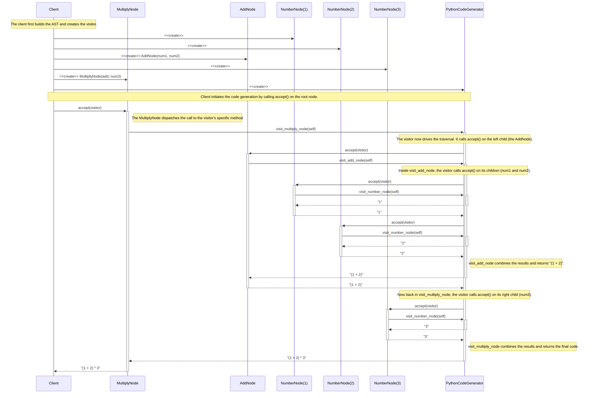
```mermaid
sequenceDiagram
    participant Client
    participant mult as MultiplyNode
    participant add as AddNode
    participant num1 as NumberNode(1)
    participant num2 as NumberNode(2)
    participant num3 as NumberNode(3)
    participant visitor as PythonCodeGenerator

    %% -- Object Creation Phase --
    Note over Client: The client first builds the AST and creates the visitor.
    Client->>num1: <<create>>
    Client->>num2: <<create>>
    Client->>add: <<create>> AddNode(num1, num2)
    Client->>num3: <<create>>
    Client->>mult: <<create>> MultiplyNode(add, num3)
    Client->>visitor: <<create>>

    %% -- Traversal Phase --
    Note over Client, visitor: Client initiates the code generation by calling accept() on the root node.
    Client->>+mult: accept(visitor)
    
    Note right of mult: The MultiplyNode dispatches the call to the visitor's specific method.
    mult->>+visitor: visit_multiply_node(self)

    Note over visitor: The visitor now drives the traversal. It calls accept() on the left child (the AddNode).
    visitor->>+add: accept(visitor)
    add->>+visitor: visit_add_node(self)

    Note over visitor: Inside visit_add_node, the visitor calls accept() on its children (num1 and num2).
    visitor->>+num1: accept(visitor)
    num1->>+visitor: visit_number_node(self)
    visitor-->>-num1: "1"
    num1-->>-visitor: "1"

    visitor->>+num2: accept(visitor)
    num2->>+visitor: visit_number_node(self)
    visitor-->>-num2: "2"
    num2-->>-visitor: "2"
    
    Note right of visitor: visit_add_node combines the results and returns "(1 + 2)".
    visitor-->>-add: "(1 + 2)"
    add-->>-visitor: "(1 + 2)"

    Note over visitor: Now back in visit_multiply_node, the visitor calls accept() on its right child (num3).
    visitor->>+num3: accept(visitor)
    num3->>+visitor: visit_number_node(self)
    visitor-->>-num3: "3"
    num3-->>-visitor: "3"

    Note right of visitor: visit_multiply_node combines the results and returns the final code.
    visitor-->>-mult: "(1 + 2) * 3"
    mult-->>-Client: "(1 + 2) * 3"
```

# Creational
## [Factory](python/patterns/creational/factory.py)
#### What
We instantiate a class with another subclass. 

#### Useful For
- Decoupling the creation of objects.
- easy to add new types of objects without changing existing code.

#### Exemple
- `Serializer` (Product) : Interface that dictate the `serialize` method.
- `Exporter` (Creator) : Abstract class that dictate the `get_serializer` method (to instantiate the `Serializer`)(absract) and the `export` method that call the `get_serializer` and then the `serialize` method of the `Serializer`.
- `JsonSerializer`|`XmlSerializer` : Concrete class that implement the `Serializer` interface.
- `JsonExporter`|`XmlExporter` : Concrete class that implement the `Exporter` abstract class.

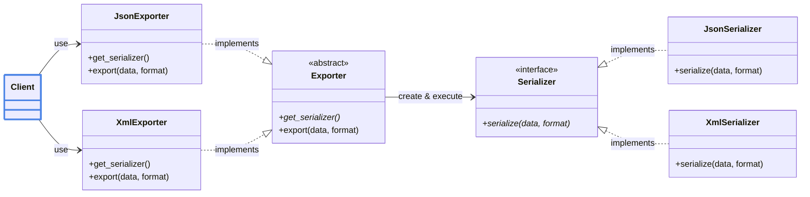
```mermaid
classDiagram
    direction LR

    class Serializer {
        <<interface>>
        +serialize(data, format)*
    }
    
    class Exporter {
        <<abstract>>
        +get_serializer()*
        +export(data, format)
    }

    class JsonSerializer {
        +serialize(data, format)
    }

    class XmlSerializer {
        +serialize(data, format)
    }

    class JsonExporter {
        +get_serializer()
        +export(data, format)
    }

    class XmlExporter {
        +get_serializer()
        +export(data, format)
    }


    Serializer <|.. JsonSerializer : implements
    Serializer <|.. XmlSerializer : implements

    JsonExporter ..|> Exporter : implements
    XmlExporter ..|> Exporter : implements

    Exporter --> Serializer : create & execute 

    Client --> JsonExporter : use
    Client --> XmlExporter  : use

    style Client stroke:#4D85E6,stroke-width:3px
```

<h5>Sequence Diagram</h5>

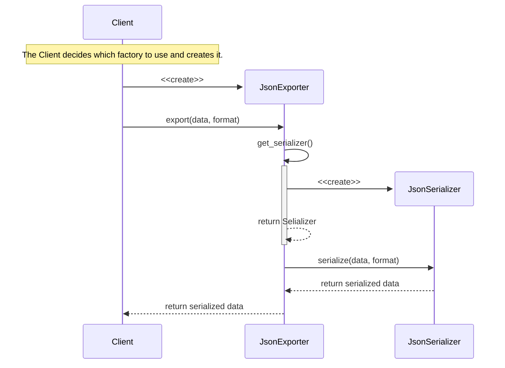
```mermaid
sequenceDiagram
    participant Client
    Note over Client: The Client decides which factory to use and creates it.
    create participant JsonExporter
    Client->>JsonExporter: <<create>>
    Client->>JsonExporter: export(data, format)
    JsonExporter->>+JsonExporter: get_serializer()

    create participant JsonSerializer
    JsonExporter->>JsonSerializer: <<create>>

    JsonExporter-->>-JsonExporter: return Selializer
    JsonExporter->>JsonSerializer: serialize(data, format)
    JsonSerializer-->>JsonExporter: return serialized data
    JsonExporter-->>Client: return serialized data
    

```

## [Abstract Factory](python/patterns/creational/abstract_factory.py)
#### What
The Client ask for a factory to create a product. The abstract factory create and use a factory to create a product.

#### Useful For
- When you need to create families of related objects without specifying their concrete classes.
- When you want to ensure that the created objects are compatible with each other.

#### Examples
- `DataParser` : (Product) Interface that dictate the `parse` method
- `DataRender` : (Product) Interface that dictate the `render` method
- `DataProcessingFactory` : (Abstract Factory) Interface that dictate the `create_parser` and `create_renderer` method
- `JSONDataParser`|`CSVDataParser` : (Concrete Product) Implement the `parse` method
- `JSONDataRenderer`| `CSVDataRenderer` : (Concrete Product) Implement the `render` method
- `JSONDataProcessingFactory`|`CSVDataProcessingFactory` : (Concrete Factory) Implement the `create_parser` and `create_renderer` method

```mermaid
classDiagram
    direction LR

    class Client {
        +process_and_export_data(factory, raw_data)
    }

    class DataProcessingFactory {
        <<Interface>>
        +create_parser()* DataParser
        +create_renderer()* DataRenderer
    }

    class DataParser {
        <<Interface>>
        +parse(data)*
    }

    class DataRenderer {
        <<Interface>>
        +render(data)*
    }

    class JSONDataProcessingFactory {
        +create_parser() JSONDataParser
        +create_renderer() JSONDataRenderer
    }

    class CSVDataProcessingFactory {
        +create_parser() CSVDataParser
        +create_renderer() CSVDataRenderer
    }

    class JSONDataParser {
        +parse(data)
    }
    class JSONDataRenderer {
        +render(data)
    }

    class CSVDataParser {
        +parse(data)
    }
    class CSVDataRenderer {
        +render(data)
    }

    Client ..> DataProcessingFactory : uses
    Client ..> DataParser : uses
    Client ..> DataRenderer : uses

    DataProcessingFactory <|.. JSONDataProcessingFactory : implements
    DataProcessingFactory <|.. CSVDataProcessingFactory : implements

    JSONDataProcessingFactory ..> JSONDataParser : creates
    JSONDataProcessingFactory ..> JSONDataRenderer : creates

    CSVDataProcessingFactory ..> CSVDataParser : creates
    CSVDataProcessingFactory ..> CSVDataRenderer : creates

    DataParser <|.. JSONDataParser : implements
    DataParser <|.. CSVDataParser : implements

    DataRenderer <|.. JSONDataRenderer : implements
    DataRenderer <|.. CSVDataRenderer  : implements

    style Client stroke:#4D85E6,stroke-width:3px
```

<h5>Sequence Diagram</h5>

```mermaid
sequenceDiagram
    participant Main as Main
    participant Client as Client
    

    create participant JSONFactory as JSONDataProcessingFactory
    Main->>JSONFactory: <<create>>
    
    Main->>Client: process_and_export_data(JSONFactory, json_data)
    activate Client

    Client->>JSONFactory: create_parser()
    activate JSONFactory
    
    create participant JSONParser as JSONDataParser
    JSONFactory->>JSONParser: <<create>>
    
    JSONFactory-->>Client: return JSONParser
    deactivate JSONFactory

    Client->>JSONFactory: create_renderer()
    activate JSONFactory

    create participant JSONRenderer as JSONDataRenderer
    JSONFactory->>JSONRenderer: <<create>>

    JSONFactory-->>Client: return JSONRenderer
    deactivate JSONFactory

    Client->>JSONParser: parse(json_data)
    activate JSONParser
    JSONParser-->>Client: parsed_data
    deactivate JSONParser

    Client->>JSONRenderer: render(parsed_data)
    activate JSONRenderer
    JSONRenderer-->>Client: rendered_json
    deactivate JSONRenderer

    deactivate Client

```

## [Builder](python/patterns/creational/builder.py)
#### What
Build an object step by step. Instead of putting all options in the constructor, we can use methods to build it.

#### Useful For
- When you want to create complex objects step by step
- When there are too many arguments in a constructor, and many are not often used

#### Exemple
- `LoggerConfigBuilder` : (Abstract Builder) Interface that dictate the functions to build a specific object (the product)
- `LoggerConfig` : (Product) The object that will be built
- `ConcreteLoggerConfigBuilder` : (Concrete Builder) The class that implements the abstract builder to build the `LoggerConfig`.
- `LoggerDirector` : (Director) The class that uses the builder to build the object with predefined steps.

```mermaid
classDiagram
    direction LR

    class Client {
        +main()
    }

    class LoggerDirector {
        -builder: LoggerConfigBuilder
        +build_debug_config()
        +build_production_config()
    }

    class LoggerConfigBuilder {
        <<Interface>>
        +set_log_level(level)
        +enable_file_logging(path)
        +set_message_format(format)
        +get_config() LoggerConfig
    }

    class ConcreteLoggerConfigBuilder {
        -config: LoggerConfig
        +reset()
        +set_log_level(level)
        +enable_file_logging(path)
        +set_message_format(format)
        +get_config() LoggerConfig
    }

    class LoggerConfig {
        <<Product>>
        +log_level: str
        +log_to_file: bool
        +log_to_console: bool
        +log_file_path: str
        +message_format: str
    }


    Client ..> LoggerDirector : "uses"
    Client ..> ConcreteLoggerConfigBuilder : "uses"

    LoggerDirector o-- "1" LoggerConfigBuilder : "has-a"

    LoggerConfigBuilder <|.. ConcreteLoggerConfigBuilder: implements

    ConcreteLoggerConfigBuilder ..> LoggerConfig : "builds"
    style Client stroke:#4D85E6,stroke-width:3px

```

<h5>Sequence Diagram</h5>

```mermaid
sequenceDiagram
    participant Client

    alt Custom Build (Client uses Builder directly)
    
        create participant Builder as ConcreteLoggerConfigBuilder
        Client->>Builder: <<create>>
        create participant Product as LoggerConfig
        Builder->>Product: <<create>>

        Note over Client, Builder: Client builds a custom configuration step-by-step
        
        Client->>Builder: set_log_level("INFO")
        activate Builder
        Builder->>Product: .log_level = "INFO"
        Builder-->>Client:
        deactivate Builder

        Client->>Builder: enable_file_logging("my_app.log")
        activate Builder
        Builder->>Product: .log_to_file = True
        Builder->>Product: .log_file_path = "my_app.log"
        Builder-->>Client:
        deactivate Builder

        Client->>Builder: set_message_format("{level} - {message}")
        activate Builder
        Builder->>Product: .message_format = "{level} - {message}"
        Builder-->>Client:
        deactivate Builder

        Note right of Builder: All steps are complete. Now, get the final object.

        Client->>Builder: get_config()
        activate Builder
        Builder-->>Client: return Product instance
        Builder->>Builder: reset()
        deactivate Builder

    else Directed Build (Client uses Director)


        create participant Director as LoggerDirector
        Client->>Director: <<create>>
        
        create participant Builder2 as ConcreteLoggerConfigBuilder
        Client->>Builder2: <<create>>
        
        create participant Product2 as LoggerConfig
        Builder2->>Product2: <<create>>
        
        Client->>Director: <<create>>(Builder)
        
        Note over Client, Director: Client asks Director for a pre-defined configuration
        
        Client->>Director: build_debug_config()
        activate Director
        
        Director->>Builder2: set_log_level("DEBUG")
        activate Builder2
        Builder2->>Product2: .log_level = "DEBUG"
        Builder2-->>Director: return self
        deactivate Builder2
        
        Director->>Builder2: enable_console_logging()
        activate Builder2
        Builder2->>Product2: .log_to_console = True
        Builder2-->>Director: return self
        deactivate Builder2
        
        deactivate Director

        Note right of Builder2: Director has finished its job. Now, get the object.

        Client->>Builder2: get_config()
        activate Builder2
        Builder2-->>Client: return Product instance
        Builder2->>Builder2: reset()
        deactivate Builder2

    end
```

## [Prototype](python/patterns/creational/prototype.py)
#### What
A way to copy existing objects without making your code dependent on their classes by implementing a `clone()` function.

#### Useful For
- When you want to create a copy of an object without knowing its concrete class.

#### Example
Python have a `copy` standard library made for that. Check the example script.

Normally that should look like :

```mermaid
classDiagram
    direction LR

    class Prototype {
        +clone()*
    }

    class SomeObject {
        +clone()
    }

    Prototype <|.. SomeObject
    SomeObject <-- Client
    style Client stroke:#4D85E6,stroke-width:3px
```

<h5>Sequence Diagram</h5>

```mermaid
sequenceDiagram
    participant Client

    create participant SomeObject
    Client->>SomeObject: <<create>>
    Client->>+SomeObject: copy.copy(SomeObject)

    create participant SomeObject2 as SomeObject
    SomeObject->>SomeObject2: <<create>>
    SomeObject-->-Client: Return the new copied object
```

## [Singleton](python/patterns/creational/singleton.py)
#### What
A class that have only one instance.

#### Useful For
- When you want to have a global access to a single instance of a class.

#### Example

```mermaid
classDiagram
    direction LR

    class Singleton {
        -instance Singleton
        +get_instance() Singleton
    }

    Singleton --> Singleton
    Client --> Singleton 
    style Client stroke:#4D85E6,stroke-width:3px
```

# Structural
## [Adapter](python/patterns/structural/adapter.py)
#### What
Convert the interface of a class into another interface clients expect. Adapter lets classes work together that couldn't otherwise because of incompatible interfaces.

Similar to `Bridge` but `Bridge` is often designed up-front, while `Adapter` is used for existing apps.

#### Useful for
- When you want to use an existing class, and its interface does not match the rest of your code.
- when you want to reuse several existing subclasses that lack some common functionality that can’t be added to the superclass

#### Exemple
- `LegacyAnalytics`: (The adaptee) Represent an existing code that can't be changed
- `IAnalyticsService`: (The target) Represent the interface that the client expect
- `AnalyticsAdapter`: (The adapter) Represent the adapter that will convert the interface of the adaptee to the interface of the target

```mermaid
classDiagram
    direction LR

    class LegacyAnalytics {
        +send_analytic_log(log_type: str, log_data_json: str)
    }
    class IAnalyticsService {
        <<interface>>
        +track_event(event_name: str, user_id: int)
    }
    class AnalyticsAdapter {
        -LegacyAnalytics _legacy_service
        +track_event(event_name: str, user_id: int)
    }
    IAnalyticsService <|.. AnalyticsAdapter

    AnalyticsAdapter --> LegacyAnalytics
    Client --> IAnalyticsService
    style Client stroke:#4D85E6,stroke-width:3px
```

<h5>Sequence Diagram</h5>

```mermaid
sequenceDiagram
    participant Client

    create participant LegacyAnalytics
    Client->>LegacyAnalytics: <<create>>


    create participant AnalyticsAdapter
    Client->>AnalyticsAdapter: <<create>>(LegacyAnalytics)

    Client->>+AnalyticsAdapter: track_event()
    AnalyticsAdapter->>+LegacyAnalytics: send_analytic_log()
    LegacyAnalytics-->>-AnalyticsAdapter: return
    AnalyticsAdapter-->>-Client: return 
```

## [Bridge](python/patterns/structural/bridge.py)
#### What
Decouple an abstraction from its implementation so that the two can vary independently.

#### Useful for
- When you want to divide/organize monolithic class in several variants
- When you want to extend the a class in several indepentant dimensions
- When you want to switch implementation at runtime

#### Example
- `MessageSender`: The implementation part of the bridge pattern. It dictate the `send` function that will be used by the `Notification` class. It will be used by the `Notification` abstract class.
- `Notification`: The abstraction part of the bridge pattern. It does the actual work of sending the message. 
- `EmailSender`|`SMSSender`: The concrete implementation of the `MessageSender` interface.
- `UrgentNotification`|`PromotionalNotification`: The concrete implementation of the `Notification` abstract class.
- `Client`: Instantiate the concrete implementation of the `Notification` abstract class and call the `send` function.

```mermaid
classDiagram
    direction LR

    class MessageSender {
        <<interface>>
        +send_message(subject: str, body: str)*
    }

    class Notification {
        <<abstract>>
        -sender MessageSender
        -subject str
        -body str
        +send()*
    }

    class EmailSender {
        +send_message(subject: str, body: str)
    }
    class SMSSender {
        +send_message(subject: str, body: str)
    }

    class UrgentNotification {
        +send()
    }
    class PromotionalNotification {
        +send()
    }


    MessageSender <|.. EmailSender
    MessageSender <|.. SMSSender
    
    Notification <|.. UrgentNotification
    Notification <|.. PromotionalNotification

    MessageSender <--* Notification
    Client --> MessageSender
    style Client stroke:#4D85E6,stroke-width:3px
```

<h5>Sequence Diagram</h5>

```mermaid
sequenceDiagram
    participant Client

    rect rgba(158, 158, 158, 0.17) 
        create participant EmailSender
        Client->>EmailSender: <<create>>
        create participant SMSSender
        Client->>SMSSender: <<create>>
    end

    rect rgba(158, 158, 158, 0.17) 
        create participant UrgentNotification
        Client->>UrgentNotification: <<create>>(SMSSender, subject, body)
        Client->>UrgentNotification: send()
        activate UrgentNotification
        UrgentNotification->>SMSSender: send_message(subject, body)
        deactivate UrgentNotification
    end

    rect rgba(158, 158, 158, 0.17) 
        create participant PromotionalNotification
        Client->>PromotionalNotification: <<create>>(EmailSender, subject, body)
        Client->>PromotionalNotification: send()
        activate PromotionalNotification
        PromotionalNotification->>EmailSender: send_message(subject, body)
        deactivate PromotionalNotification
    end
```

## [Composite](python/patterns/structural/composite.py)
#### What
A way to interact with a tree-like structure of simple and complex objects with the same functions.

#### Useful for
- When you want the client code to treat both simple and complex elements uniformly.
- When you have a tree structure of simple and complex objects.

#### Example
- `FileSystemComponent`: The abstract class that dictate the base functions for both the `File` class (leaf) and the `Directory` class (composite)
- `File`: The leaf class that implements the base functions
- `Directory`: The composite class that implements the base functions and also has a list of `FileSystemComponent` objects (other `Directory` or `File`)

```mermaid
classDiagram
    direction LR

    class FileSystemComponent {
        <<abstract>>
        -name str
        +get_name() str
        +get_size()* int
    }

    class File {
        -size int
        +get_size() int
    }
    class Directory {
        -children list[FileSystemComponent]
        +add(component: FileSystemComponent)
        +remove(component: FileSystemComponent)
        +get_size() int
    }

    FileSystemComponent <|.. File
    FileSystemComponent <|.. Directory

    Directory *-->  FileSystemComponent
    Client --> FileSystemComponent
    style Client stroke:#4D85E6,stroke-width:3px
```

<h5>Sequence Diagram</h5>

```mermaid
sequenceDiagram
    participant Client

    rect rgba(158, 158, 158, 0.17) 
        create participant File1
        Client->>File1: <<create>>
        create participant File2
        Client->>File2: <<create>>
        create participant File3
        Client->>File3: <<create>>
    end

    rect rgba(158, 158, 158, 0.17) 
        create participant SubDirectory
        Client->>SubDirectory: <<create>>
        Client->>SubDirectory: add(File2)
        
        create participant RootDirectory
        Client->>RootDirectory: <<create>>
        Client->>RootDirectory: add(File1)
        Client->>RootDirectory: add(File3)
        Client->>RootDirectory: add(SubDirectory)
    end

    rect rgba(158, 158, 158, 0.17)
        Client->>+RootDirectory: get_size()
        RootDirectory->>+File1: get_size()
        File1-->>-RootDirectory: return size
        RootDirectory->>+File3: get_size()
        File3-->>-RootDirectory: return size

        RootDirectory->>+SubDirectory: get_size()
        SubDirectory->>+File2: get_size()
        File2-->>-SubDirectory: return size
        SubDirectory-->>-RootDirectory: return size

        RootDirectory-->>-Client: return size
    end

```

## [Decorator](python/patterns/structural/decorator.py)
#### What 
(Not to be confused with the python @ decorator that wrap functions, here we wrap entire objects (= all of their methods))

A way to add new behaviors to objects dynamically without altering their implementation.

#### Useful For
- Adding responsibilities to individual objects dynamically and transparently.
- Extending functionality without modifying existing code.
- Avoiding subclass explosion when adding multiple features.

#### Example
- `IDataManager`: Interface that dictate the behavior of the component and decorators with the functions `write_data` and `read_data`.
- `SimpleFileManager`: Concrete component that implements the `IDataManager` interface. Is the base object that will be decorated.
- `DataManagerDecorator`: Base decorator that implements the `IDataManager` interface and holds a reference to the component to be decorated (can be a concrete component or another decorator).
- `CompressionDecorator`|`EncryptionDecorator`: Concrete decorators that add new behaviors to the component (with the same functions as the interface/base decorator/core component).

(The decorators can be stacked to add multiple behaviors to the component, and their order matters)

```mermaid
classDiagram
    direction LR

    class IDataManager {
        <<Interface>>
        +write_data(filename, data)*
        +read_data(filename)* bytes
    }

    class SimpleFileManager {
        +write_data(filename, data)
        +read_data(filename) bytes
    }

    class DataManagerDecorator {
        -wrapped_component: IDataManager
        +write_data(filename, data)
        +read_data(filename) bytes
    }

    class CompressionDecorator {
        +write_data(filename, data)
        +read_data(filename) bytes
    }

    class EncryptionDecorator {
        +write_data(filename, data)
        +read_data(filename) bytes
    }

    IDataManager <|.. SimpleFileManager
    IDataManager <|.. DataManagerDecorator

    DataManagerDecorator <|-- CompressionDecorator
    DataManagerDecorator <|-- EncryptionDecorator

    DataManagerDecorator o-- IDataManager
    Client --> IDataManager
    style Client stroke:#4D85E6,stroke-width:3px
```

<h5>Sequence Diagram</h5>

```mermaid
sequenceDiagram
    participant Client

    create participant FileManager
    Client->>FileManager: <<create>>

    Note over Client: Client constructs the decorator stack
    create participant CompressionDecorator
    Client->>CompressionDecorator: <<create>>(FileManager)
    create participant EncryptionDecorator
    Client->>EncryptionDecorator: <<create>>(CompressionDecorator)

    alt Write Operation
        Client->>+EncryptionDecorator: write_data(filename, my_data)
        
        Note right of EncryptionDecorator: Encrypts data first
        EncryptionDecorator->>+CompressionDecorator: write_data(filename, encrypted_data)
        
        Note right of CompressionDecorator: Compresses data second
        CompressionDecorator->>+FileManager: write_data(filename, compressed_data)
        
        Note right of FileManager: Writes final data to disk
        
        deactivate FileManager
        deactivate CompressionDecorator
        deactivate EncryptionDecorator
    end

    alt Read Operation
        Client->>+EncryptionDecorator: read_data(filename)
        
        EncryptionDecorator->>+CompressionDecorator: read_data(filename)
        
        CompressionDecorator->>+FileManager: read_data(filename)
        
        FileManager-->>-CompressionDecorator: return raw_bytes
        
        Note right of CompressionDecorator: Decompresses data
        CompressionDecorator-->>-EncryptionDecorator: return decompressed_bytes
        
        Note right of EncryptionDecorator: Decrypts data
        EncryptionDecorator-->>-Client: return original_data
    end
```

## [Facade](python/patterns/structural/facade.py)
#### What
A way to simplify a complex system by providing a unified interface to the user. It hides the complexity of the system and provides a simple interface to interact with it.

#### Useful for
- Simplifying complex systems
- Structure the system in layers

#### Example
- `InventorySystem`|`PaymentGateway`|`ShippingService`: Some object that are parts of a complex system.
- `OrderFacade`: A facade that simplifies the interaction with the complex system. The `Client` only interfact with the facade. Contains the complex logic of the system.

```mermaid
classDiagram
    direction LR

    class OrderFacade {
        +place_order(product_id, customer_id, amount, address)
    }
    class InventorySystem {
        +check_stock(product_id)
    }
    class PaymentGateway {
        +process_payment(customer_id, amount)
    }
    class ShippingService {
        +schedule_shipping(order_id, address)
    }
    OrderFacade --> InventorySystem
    OrderFacade --> PaymentGateway
    OrderFacade --> ShippingService

    Client --> OrderFacade
    style Client stroke:#4D85E6,stroke-width:3px
```

## [Flyweight](python/patterns/structural/flyweight.py)
#### What
A way to reduce the memory usage by sharing common data between multiple objects. It is used to store the intrinsic state of the object and the extrinsic state is passed to the object when it is needed.

#### Useful For
- When you have a huge number of objects that have a lot of common data and would not fir in RAM.

#### Exemple
- `TreeType`: The Flyweight. Stores the intrinsic (shared) state.
- `TreeFactory`: The Flyweight Factory. Creates and manages the flyweights.
- `Tree`: The Context. Stores the extrinsic (unique) state and a reference to a TreeType (flyweight).
- `Forest`: The Client. Uses the flyweights to render the forest.

```mermaid
classDiagram
    direction LR
        class Forest {
        <<Client>>
        -factory: TreeFactory
        -trees: list~Tree~
        +plant_tree(x, y, model, texture, color)
        +render_forest()
    }

    class TreeFactory {
        <<FlyweightFactory>>
        -tree_types: dict
        +get_tree_type(model, texture, color) TreeType
    }

    class TreeType {
        <<Flyweight>>
        +model: str
        +texture: str
        +color: str
        +render(x, y)
    }

    class Tree {
        <<Context>>
        +x: int
        +y: int
        +render()
    }


    Forest --> TreeFactory
    Forest o--> Tree
    TreeFactory o--> TreeType
    Tree --> TreeType
```

<h5>Sequence Diagram</h5>

```mermaid

sequenceDiagram
    participant Main as main

    create participant TreeFactory as TreeFactory
    Main->>TreeFactory: <<create>>

    create participant Forest as Forest (Client)
    Main->>Forest: <<create>>(TreeFactory)

    loop For each tree to be planted

        Main->>Forest: plant_tree(x, y, model, texture, color)
        activate Forest

        Forest->>TreeFactory: get_tree_type("Oak", "Oak Texture", "Green")
        activate TreeFactory

        alt First time requesting an "Oak" (Cache Miss)

            note right of TreeFactory: Key not in cache.
            create participant OakTreeType as Oak TreeType<br>(Flyweight)
            TreeFactory->>OakTreeType: <<create>>("Oak", "Oak Texture", "Green")
            TreeFactory-->>Forest: return OakTreeType instance

        else Subsequent time requesting an "Oak" (Cache Hit)

            note right of TreeFactory: Key found in cache.
            TreeFactory-->>Forest: return existing OakTreeType instance

        end
        
        deactivate TreeFactory

        note left of Forest: Create context with unique state (x,y)<br>and shared flyweight.
        create participant OakTree1 as Oak Tree 1<br>(Context)
        Forest->>OakTree1: <<create>>(x, y, OakTreeType)
        
        deactivate Forest
    end

    create participant OakTree2 as Oak Tree 2<br>(Context)
    TreeFactory ->> OakTree2: <<create>>(x, y, OakTreeType)
    Note over Main, OakTree2: ... Time passes, more trees are planted ...

    Main->>Forest: render_forest()
    activate Forest

    Note over Forest: Loop through all Tree objects
    
    Forest->>OakTree1: render()
    activate OakTree1
    
    Note right of OakTree1: Delegate rendering to the flyweight,<br>passing extrinsic state (x, y).
    OakTree1->>OakTreeType: render(x1, y1)
    
    deactivate OakTree1

    Forest->>OakTree2: render()
    activate OakTree2
    OakTree2->>OakTreeType: render(x2, y2)
    deactivate OakTree2

    deactivate Forest
```

## [Proxy](python/patterns/structural/proxy.py)
#### What
A way to control the access to an object. Can let you execute things before or after the request reaches the object.

(Similar to `Facade`, but the proxy have the same interface as the real object)

#### Useful For
- Lazy initialization
- Access control
- Caching

#### Example
- `IReportGenerator`: (ServiceInterface) Dictate what the real object (and proxy) should do.
- `RealReportGenerator`: (Service) The real object that does the work.
- `SecureReportProxy`: (Proxy) Controls access to the real object. The `Client` only interact with the proxy, not the real service.
- `User`: Helper class for the example, not part of the pattern.

```mermaid
classDiagram
    direction LR

    class IReportGenerator {
        <<Interface>>
        +generate_report()*
    }

    class RealReportGenerator {
        +generate_report()
    }

    class SecureReportProxy {
        -user: User
        -real_generator: RealReportGenerator
        +generate_report()
        -check_access() bool
    }
     

    IReportGenerator <|.. RealReportGenerator
    IReportGenerator <|.. SecureReportProxy
    
    Client --> SecureReportProxy : (here) uses
    Client --> IReportGenerator : can use
    
    SecureReportProxy *--> RealReportGenerator : delegates to
    style Client stroke:#4D85E6,stroke-width:3px
```

<h5>Sequence Diagram</h5>

```mermaid
sequenceDiagram
    participant Client

    alt Access Granted (Admin User)

        create participant Proxy as SecureReportProxy
        Client->>Proxy: <<create>>(admin_user)
        Client->>+Proxy: generate_report()
        
        Proxy->>Proxy: _check_access()
        note right of Proxy: Access is granted.

        alt Lazy Initialization (First valid call)
            note right of Proxy: Real object is None, so create it.
            create participant RealSubject as RealReportGenerator
            Proxy->>RealSubject: <<create>>()
            activate RealSubject
            note left of RealSubject: Heavy initialization runs (2s sleep)
            deactivate RealSubject
        end

        note right of Proxy: Delegate the call to the real object.
        Proxy->>+RealSubject: generate_report()
        RealSubject-->>-Proxy: return "--- Financial Report ---"
        
        Proxy-->>-Client: return "--- Financial Report ---"

    else Access Denied (Viewer User)

        Client->>Proxy: <<create>>(viewer_user)
        Client->>+Proxy: generate_report()

        Proxy->>Proxy: _check_access()
        note right of Proxy: Access is denied.
        
        note over Proxy, RealSubject: If the access was granted, <br/>the real object would not have to be initialized again.
        
        Proxy-->>-Client: return "Error: You do not have permission..."

    end
```

