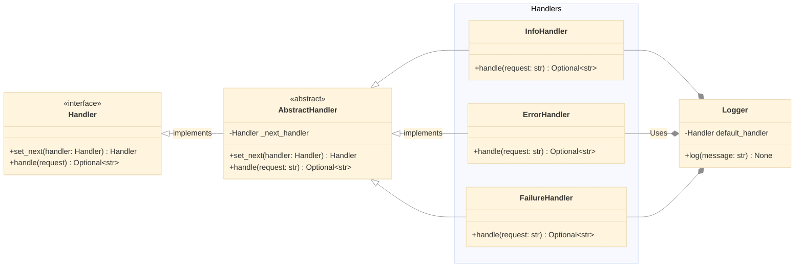

# Behavioral
## Chain of Responsibility

```mermaid
---
config:
    theme: 'base'
    themeVariables:
       background: '#727272ff'
---
classDiagram
    direction LR

    class Handler {
        <<interface>>
        +set_next(handler: Handler) Handler
        +handle(request) Optional~str~
    }

    class AbstractHandler {
        <<abstract>>
        -Handler _next_handler
        +set_next(handler: Handler) Handler
        +handle(request: str) Optional~str~
    }

    class InfoHandler {
        +handle(request: str) Optional~str~
    }
    class ErrorHandler {
        +handle(request: str) Optional~str~
    }
    class FailureHandler {
        +handle(request: str) Optional~str~
    }

    class Logger {
        -Handler default_handler
        +log(message: str) None
    }

    Handler <|-- AbstractHandler : implements
    AbstractHandler <|-- InfoHandler
    AbstractHandler <|-- ErrorHandler : implements
    AbstractHandler <|-- FailureHandler

    InfoHandler --* Logger
    ErrorHandler --* Logger : Uses
    FailureHandler --* Logger

    namespace Handlers {
        class InfoHandler
        class ErrorHandler
        class FailureHandler
    }
```

# Creational

# Structural