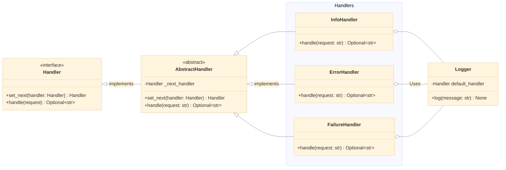
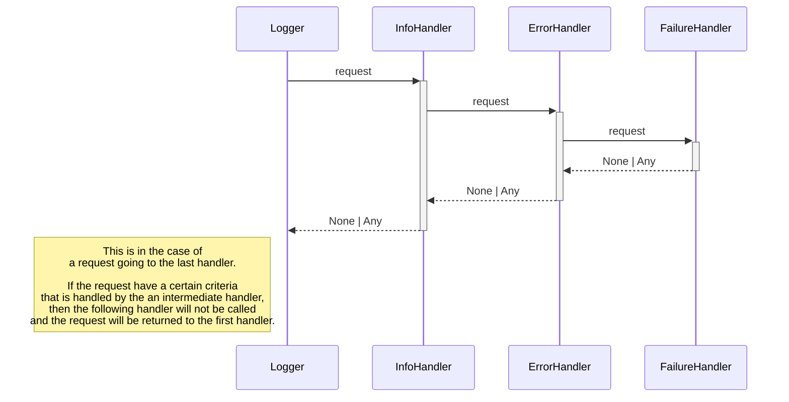

# Behavioral
## Chain of Responsibility

#### What
Pass a request through a chain of handlers. Each handler decides whether to process the request or pass it to the next handler in the chain.

#### Useful for
- avoiding coupling between objects. The sender only need to know *how* to send the request, not *who* will handle it
- Adding/removing handlers easily (isolated codes)
- Single Responsibility Principle

#### Exemple

BASE
- `Handler` : Interface that dictate what methods are mandatory
- `AbstractHandler` : Boilerplate code for the handlers

EXAMPLE
- `InfoHandler`, `ErrorHandler`, `FailureHandler` : Concrete handlers that each implement a way of processing the request
- `Logger` : Controller that build the chain of handlers and send the request to the first handler. Help use the chain of responsibility 

# Creational

# Structural