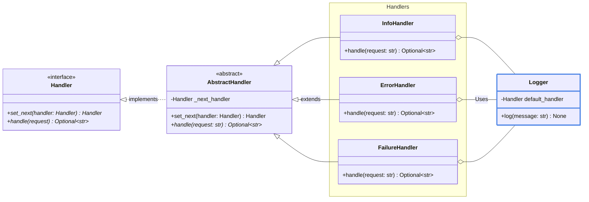
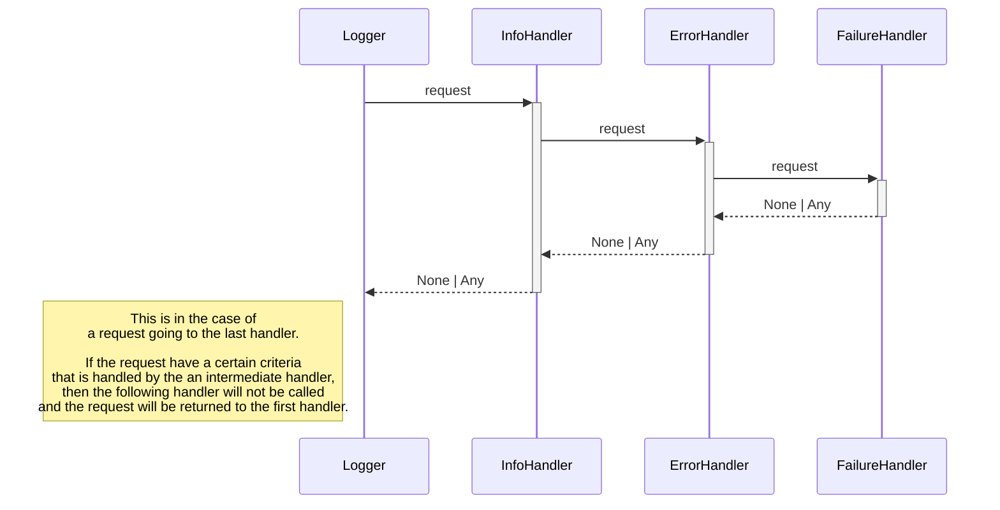
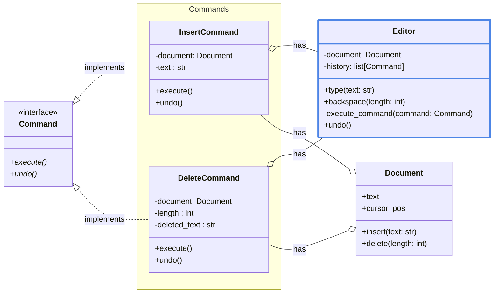
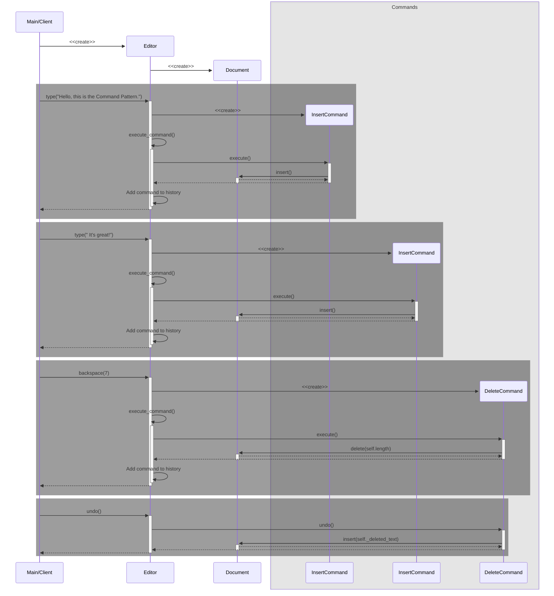

# Behavioral
## Chain of Responsibility
#### What
Pass a request through a chain of handlers. Each handler decides whether to process the request or pass it to the next handler in the chain.

#### Useful for
- Avoiding coupling between objects. The sender only need to know *how* to send the request, not *who* will handle it
- Adding/removing handlers is easy (code isolation)
- Single Responsibility Principle

#### Exemple
- `Handler` : Interface that dictate what methods are mandatory
- `AbstractHandler` : Boilerplate code for the handlers
- `InfoHandler`, `ErrorHandler`, `FailureHandler` : Concrete handlers that each implement a way of processing the request
- `Client` | `Logger` : Controller that build the chain of handlers and send the request to the first handler. Help use the chain of responsibility 

## Command
#### What
Encapsulate all the information needed to perform an action. Each command can do an action or delegate it to a receiver. An invoker will execute these commands.

#### Useful for
- Decoupling the sender and receiver of a request (the invoker don't need to know the receiver implementation, it just execute the command)
- Adding/removing commands is easy (code isolation)
- Creating command history with undo/redo operations

#### Exemple
- `Command` : Interface that dictate the `execute` and `undo` method
- `Receiver` | `Document` : Contains the complex/external business logic
- `InsertCommand`, `DeleteCommand` : Implement the `execute` and `undo` method 
- `Invoker` | `Editor` : Contains the commands and execute them

# Creational

# Structural