# Behavioral
## Chain of Responsibility
#### What
Pass a request through a chain of handlers. Each handler decides whether to process the request or pass it to the next handler in the chain.

#### Useful for
- Avoiding coupling between objects. The sender only need to know *how* to send the request, not *who* will handle it
- Adding/removing handlers is easy (code isolation)
- Single Responsibility Principle

#### Exemple
- `Handler` : Interface that dictate what methods are mandatory
- `AbstractHandler` : Boilerplate code for the handlers
- `InfoHandler`, `ErrorHandler`, `FailureHandler` : Concrete handlers that each implement a way of processing the request
- `Client` | `Logger` : Controller that build the chain of handlers and send the request to the first handler. Help use the chain of responsibility 

<h5>Sequence Diagram</h5>

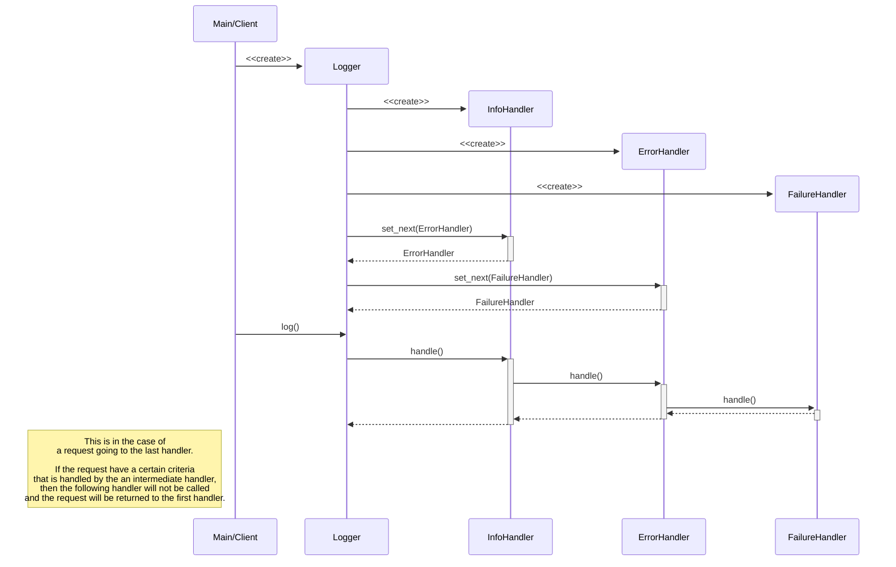

## Command
#### What
Encapsulate all the information needed to perform an action. Each command can do an action or delegate it to a receiver. An invoker will execute these commands.

#### Useful for
- Decoupling the sender and receiver of a request (the invoker don't need to know the receiver implementation, it just execute the command)
- Adding/removing commands is easy (code isolation)
- Creating command history with undo/redo operations

#### Exemple
- `Command` : Interface that dictate the `execute` and `undo` method
- `Receiver` | `Document` : Contains the complex/external business logic
- `InsertCommand`, `DeleteCommand` : Implement the `execute` and `undo` method 
- `Invoker` | `Editor` : Contains the commands and execute them

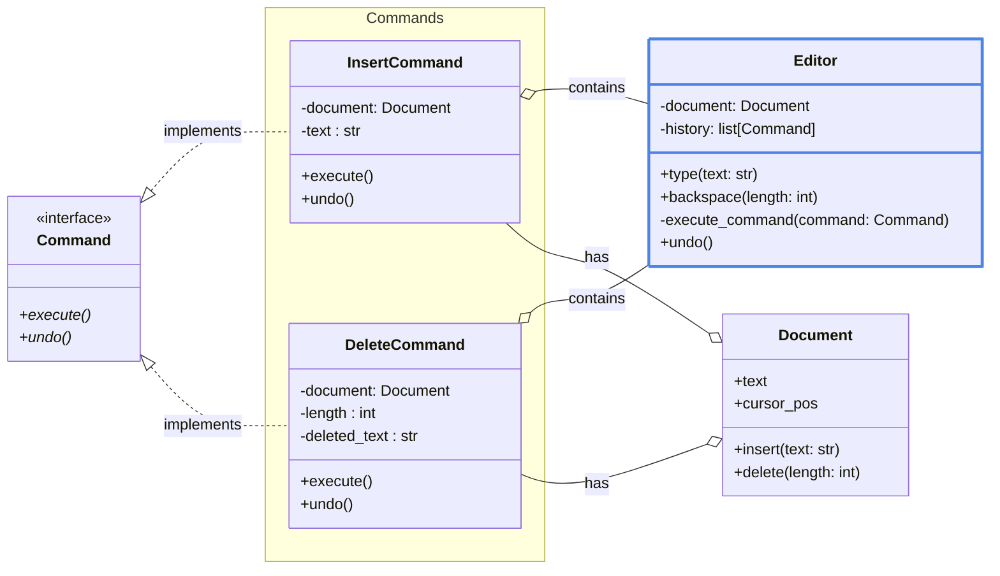

<h5>Sequence Diagram</h5>

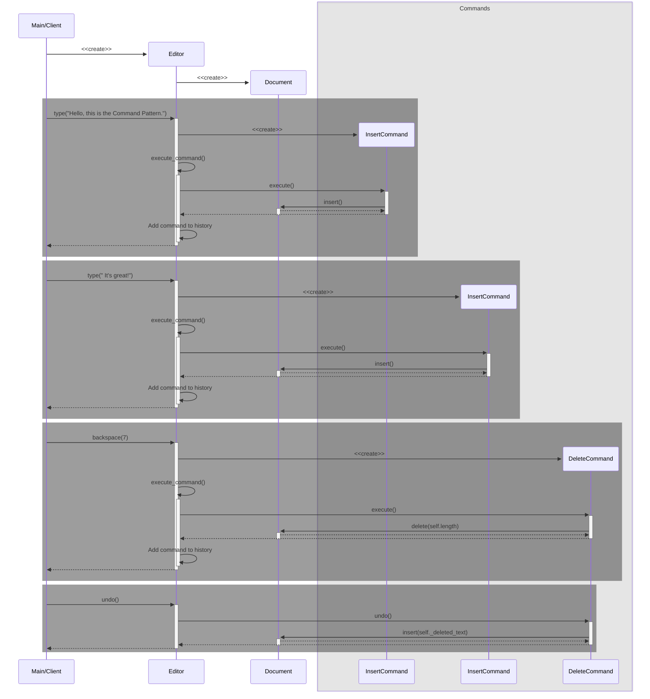

## Iterator
#### What
We have a collection of items in a certain structure (item in list/graph, words in sentence ...). We want to traverse that collection. We split the storing and the traversal behaviour

#### Useful for
- Decouple the Client and the logic : The client doesn't need to know *how* or *what* to traverse, they just get the next item
- Having multiple Iterator for a type of collection (exemple: graph => depth or breadth traversal) 
- Simplify the collection : Only store and create the iterator for the kind of traversing we want

#### Exemple 
- `Iterator` : Interface that dictate the `next` method (traverse the collection)
- `IterableCollection` : Interface that dictate the `iter` method (give the mean to traverse the collection)
- `WordCollection` : Store the data and give access to an iterator
- `WordIterator` : Store the collection and the function to traverse it

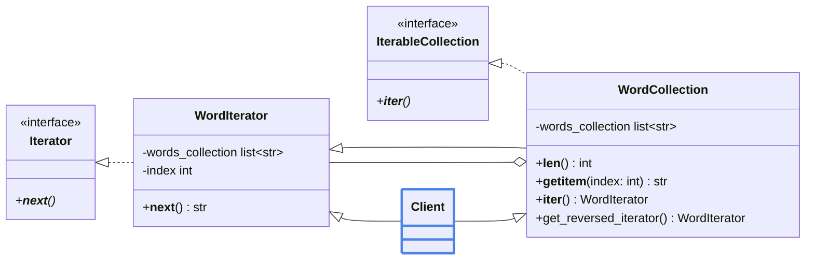

<h5>Sequence Diagram</h5>

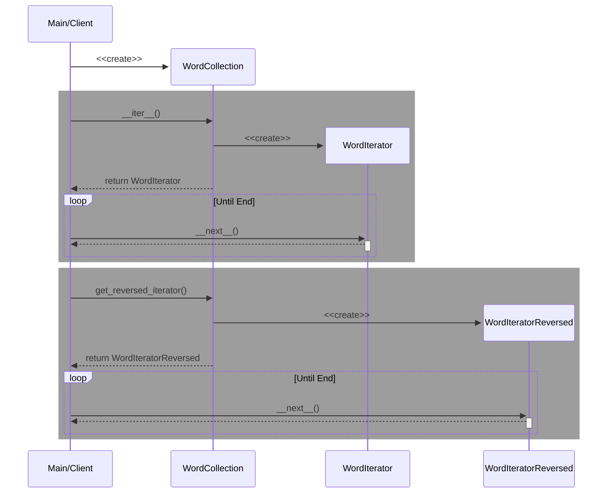

## Mediator

Not really useful

Just set a class that let you interface with a certain set of other object (exemple: A Dialog let us talk to its child (button, menus ...))

## Memento
#### What
A class that store/remember an object state. 

#### Useful for
Some undo redo operation, transactional operations, rollbacks, versioning ...

#### Exemple
- `Memento` : Interface that dictate the `get_save` method
- `Originator` : Interface that dictate the `save` method
- `TextEditor` : Store the current text state
- `TextEditorSnapshot` : Store **a** text state at a certain time. Do not expose the internal state
- `History` : Store the collection of `TextEditorSnapshot`. Have no access to its internal state

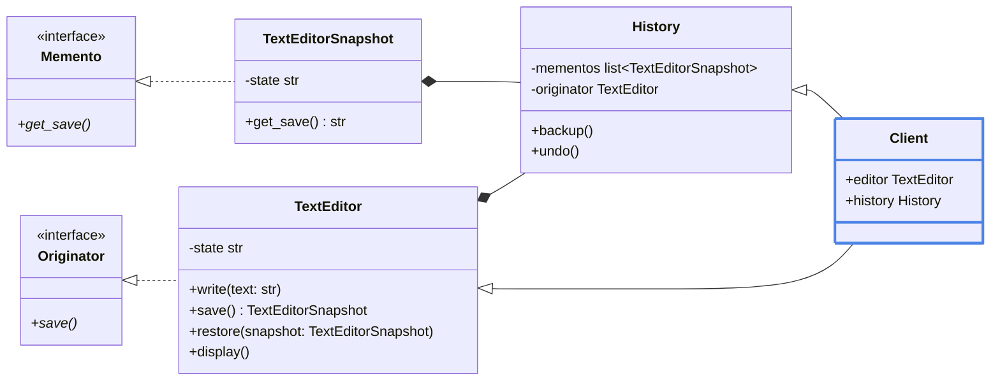

<h5>Sequence Diagram</h5>

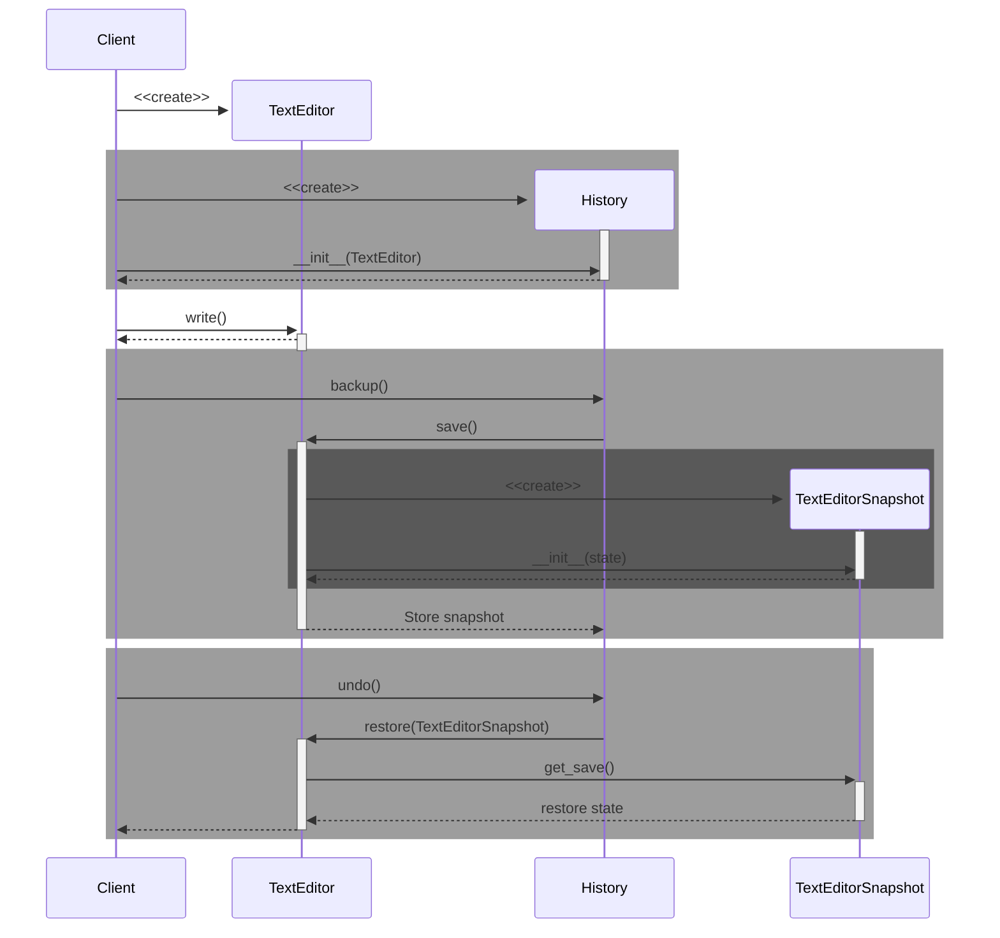

## Observer
#### What
Observer pattern can subscribe to other objects and receive notification

#### Useful for 
- Send info to different system without them checkin continuously
- We can dynamically attach or detach observers at runtime
- Decouple the publisher from the action took (Here we send log info, but we don't know how is it handled)

#### Exemple
- `Subscriber` : dictate the `update` function
- `ConsoleSubscriber`, `FileSubscriber` : manage the reception of a message and handle how to proccess it (or pass it to the right system)
- `LoggerPublisher` : Emit the event to the Subscriber it have

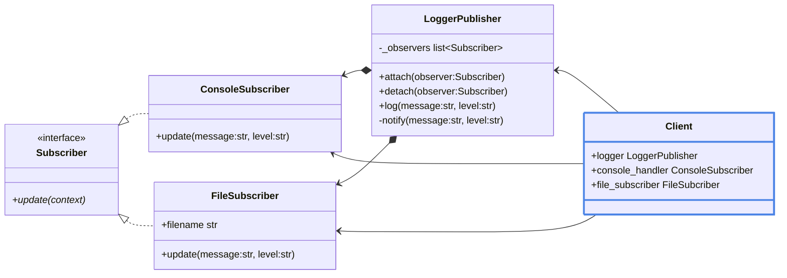

<h5>Sequence Diagram</h5>

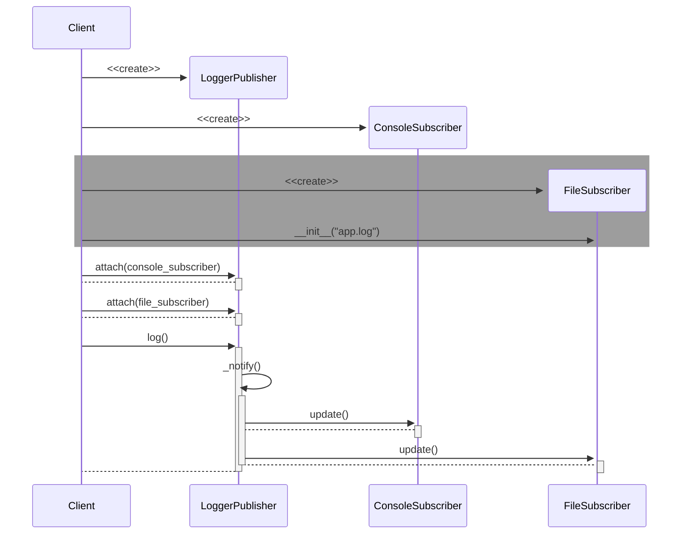

## State
#### What
Extracting the state of an object into a separate set of class. Each class contains the logic and can change dynamically the state of the context object to another state if wanted.

#### Useful for
- Managing a state system and avoiding bloat/mess with an accumulation of conditions

#### Exemple

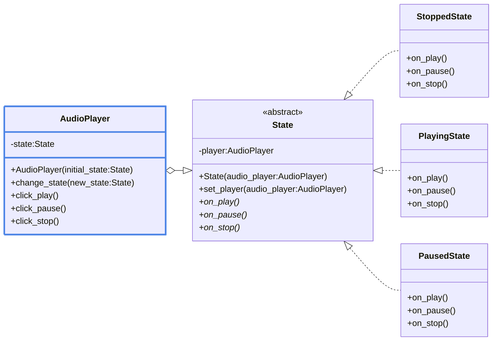

<h5>Sequence Diagram</h5>

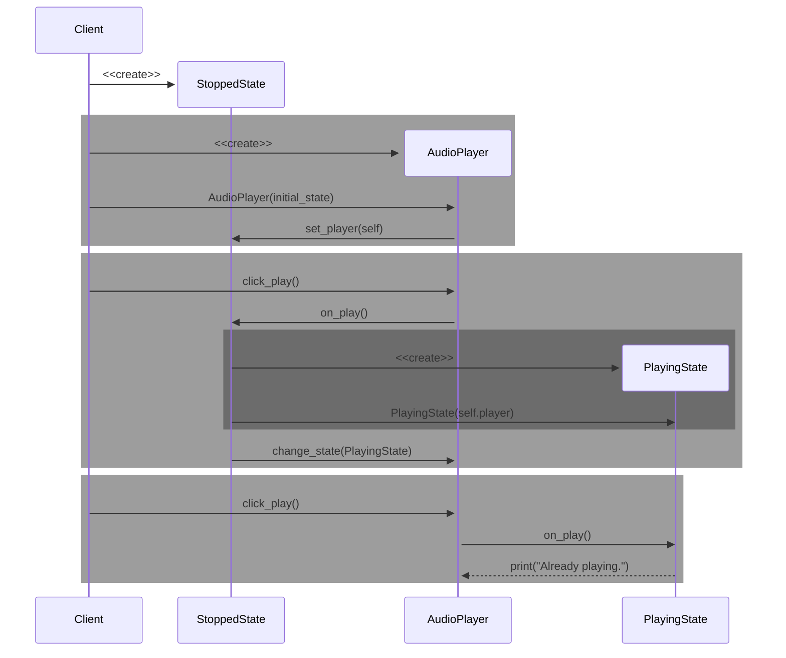

## Strategy
#### What
A way to externalize algorithm from an object.

It architecture is similar to `State` but it does not externalize state but logic.

It looks similar to `Command` because it parameterizes an object with action. But `Command` convert an operation in an object, while `Strategy` describes different way of doing the same thing, letting us swap algorithms in a signle *context* class

#### Useful For
- Simplifying the `Context` class by externalizing the logic.
- We can easily add other algorithms without touching the `Context` class.
- We can change the algorithm at runtime.

#### Example

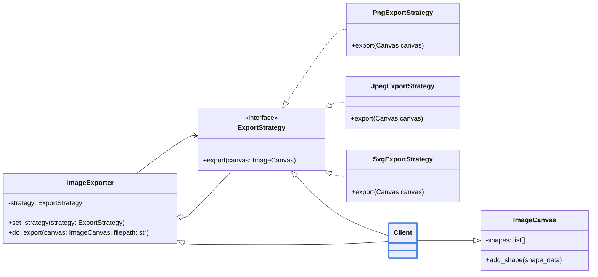

<h5>Sequence Diagram</h5>

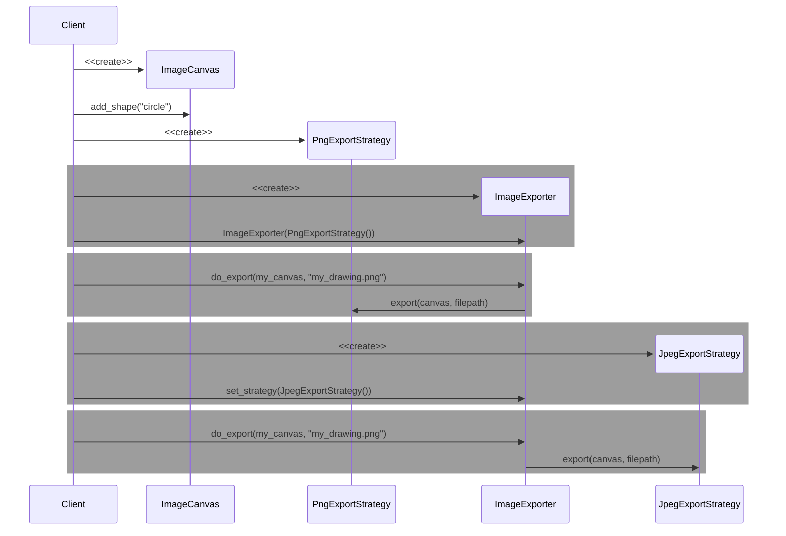

# Creational

# Structural